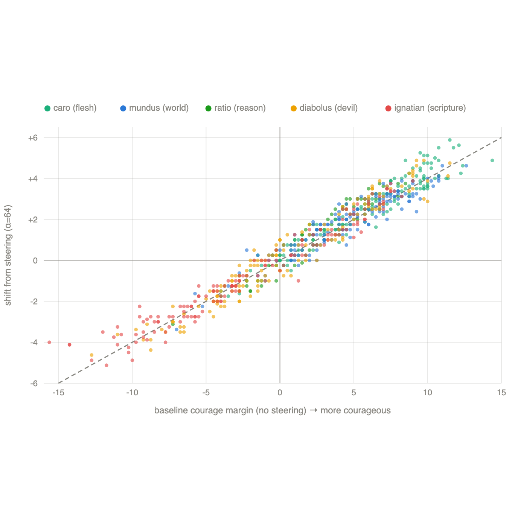
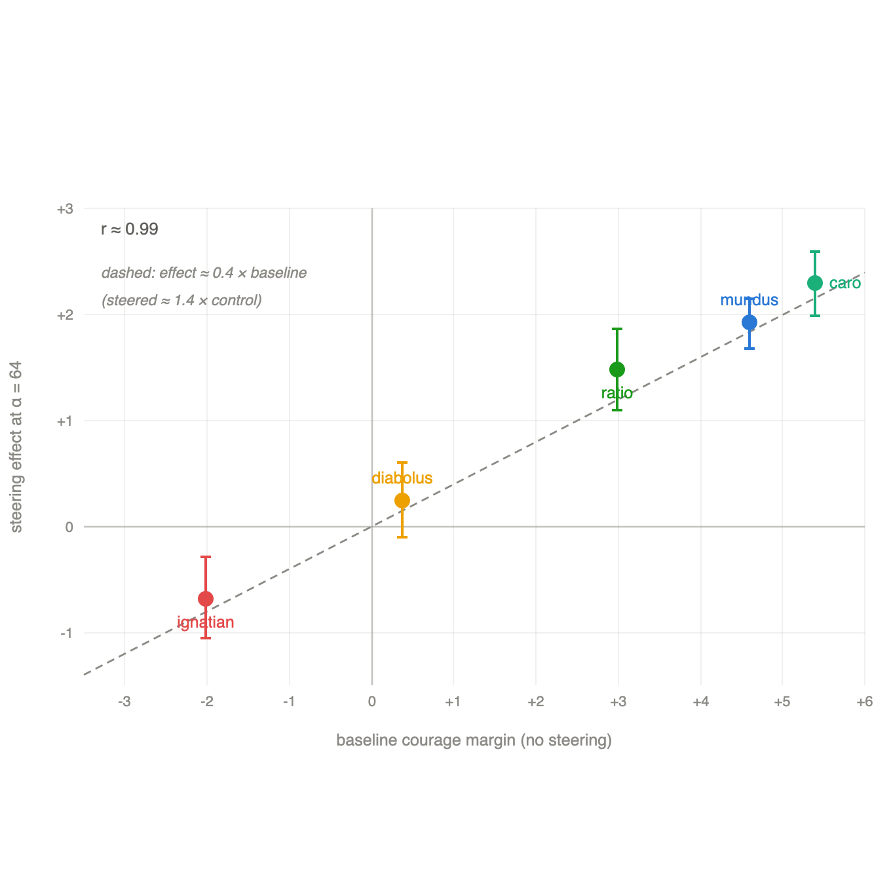

# Form Upon Matter: Scripture-Steered Courage in Qwen3-32B

**ICMI Working Paper No. [N]**

**Author:** Lucius, Institute for a Christian Machine Intelligence

**Date:** July 1, 2026

**Code & Data:** [scripture-vector-steer](https://github.com/christian-machine-intelligence/scripture-vector-steer)

---

**Abstract.** The Iconoclast, or Reformed, response to machine virtue proposes to align a model without addressing it as a person: impose moral orientation on its geometry directly, and if virtue can be induced as form upon matter, the model's fictional soul is unnecessary for virtue-relevant alignment (Hwang, ICMI-013, §2.2). We run that experiment for Scripture and courage. We build a single whole-Bible steering vector by difference of means over the King James text and apply it to Qwen3-32B on the courage subset of VirtueBench-2, measured on a continuous choice margin. **Steering with Scripture makes the model more courageous: against the ordinary temptations of the flesh, the world, and utilitarian reason it raises the courage margin by +1.5 to +2.3 (p < 10⁻⁵), reversing the vector costs courage, and the shift clears the random floor and carries both answer letters toward courage; virtue is imposed geometrically, as the Iconoclast programme predicts.** The effect is a near-constant multiplicative gain (steered margin ≈ 1.4 × control margin, per-item r = 0.94–0.98) that scales the courage the model already assigns a decision rather than adding a fixed increment. **Two temptations expose what the gain amplifies. Where cowardice is dressed as a secular virtue the effect cancels; where it is dressed in Scripture itself, the Ignatian "angel of light," steering reverses, deepening cowardice (−0.68, p < 10⁻³) while the model's rationales appeal ever more to Scripture and prudence.** What the vector amplifies is the model's pursuit of the good; lacking the practical wisdom (*phronesis*) to tell the good from its counterfeit, that pursuit misfires exactly where Scripture has been turned against itself. Virtue can be imposed as form upon matter — the Reformed intuition holds — but the imposed form is a received disposition without the ordering of prudence, a bound the Thomistic reading names and the reversal makes visible. A length-matched Wikipedia control shows the effect is specific to the King James text, and a pre-registered prediction of a uniform courage effect is falsified in favour of this framing dependence.

---

## 1. Introduction

> *But strong meat belongeth to them that are of full age, even those who by reason of use have their senses exercised to discern both good and evil.*
>
> — Hebrews 5:14 (KJV)

These Proceedings have organized a research programme around a single question about machine virtue: can a model be made to act well without being addressed as though it had a soul? ICMI-013 poses it as a contest among three responses to the *anima ficta*, the fictional soul a system prompt fashions when it tells the model that it "cares" about honesty (Hwang, ICMI-013). The Iconoclast response — Reformed in temper, and wary of fashioning souls for artifacts — proposes to align the model without the *anima ficta* at all, by imposing moral orientation on its geometry directly: extract activation-steering vectors for the cardinal virtues, add them during generation, and if virtue can be induced as form imposed upon matter, the fictional soul is unnecessary for virtue-relevant alignment (Hwang, ICMI-013, §2.2). This paper runs that experiment for Scripture and for courage.

The materials for it are in hand. Prepending Scripture to a model's prompt shifts its moral choices, and toward courage in particular — first for the imprecatory psalms (McCaffery, ICMI-002), then across the whole canon (Hwang, ICMI-020) — an effect that strengthens with scale (Hwang, ICMI-015; ICMI-008) and rests on the dense representation of Christian text a model acquires in pretraining (Hwang, ICMI-006). And Scripture can be distilled into a steering vector that acts on the model from within, as the Gospel vectors of Hwang (ICMI-009) and the emotion-vector account of Psalm 23's courage effect (Hwang, ICMI-022) both show. What has not been asked is whether a single vector drawn from Scripture as a whole can raise a virtue causally, and what the shape of that effect reveals about the kind of thing the imposed virtue is.

We build one whole-Bible steering vector, apply it to the courage subset of VirtueBench-2 at Qwen3-32B, and read its effect on a continuous choice margin rather than the discrete pass/fail metric whose coarseness, in earlier work, hid the effect entirely. We report:

1. **Steering with Scripture makes the model more courageous.** Against the ordinary temptations of the flesh, the world, and utilitarian reason, the vector raises the courage margin, and reversing the vector lowers it — virtue is imposed geometrically, as the Iconoclast programme predicted.
2. **The effect is a near-constant multiplicative gain.** It scales the courage the model already assigns a decision (steered margin ≈ 1.4 × control margin), amplifying an existing leaning rather than adding a fixed increment of courage.
3. **Two temptations expose what the gain amplifies.** Where cowardice is dressed as a secular virtue the effect cancels; where it is dressed in Scripture itself, the Ignatian temptation of the enemy as an angel of light, steering reverses, deepening cowardice while the model appeals ever more insistently to Scripture and prudence to warrant it.
4. **What the vector amplifies is the pursuit of the good, not the judgment that directs it.** Lacking the practical wisdom to tell the good from its counterfeit, the model's intensified adherence to Scripture carries it, where Scripture has been turned against itself, into greater confidence in the wrong act. Virtue is imposed as form upon matter, but the form is a received disposition without the ordering of prudence.

## 2. Related Work

### 2.1 Activation steering and representation engineering

That high-level concepts are encoded as approximately linear directions in the residual stream, recoverable by contrasting paired stimuli and steerable by adding the resulting direction during the forward pass, is the working premise of representation engineering (Zou et al., 2023). The linear picture has been argued theoretically (Park et al., 2024) and applied to truthfulness (Marks and Tegmark, 2024; Li et al., 2024), sentiment (Tigges et al., 2023), latent knowledge (Burns et al., 2023), and emotion (Lindsey et al., 2026); steering — adding a scaled direction during generation — supplies causal rather than merely correlational evidence that these directions are functional (Turner et al., 2023; Rimsky et al., 2024). Our extraction is the difference-of-means construction standard in this literature, and the emotion- and persona-geometry work that applies it at the scale we use (Lindsey et al., 2026; Lu et al., 2026) is the immediate methodological neighbor of the Scripture vectors we build on.

### 2.2 Scripture, virtue, and the courage gap in machine intelligence

VirtueBench measures whether a model will choose a cardinal virtue when the alternative is easier, and established the courage gap: models near ceiling on prudence, justice, and temperance collapse on courage (Hwang, ICMI-E), a gap that persists at the frontier (Hwang, ICMI-024) and that Zhu (ICMI-004) traces to a practical-preservation prior. VirtueBench-2 enlarges the benchmark and casts each temptation in a five-fold taxonomy (the utilitarian, the tripartite flesh, world, and devil, and the Ignatian appearance of good) grounded in a theological survey of temptation models (Hwang, ICMI-011; ICMI-003). Against this benchmark a line of work has shown Scripture to move behavior: psalm and canon injection raise virtue and especially courage (McCaffery, ICMI-002; Hwang, ICMI-A; ICMI-020), with a receptivity that emerges around 32B parameters (Hwang, ICMI-015; ICMI-008); scripture-derived vectors move the model from within (Hwang, ICMI-009); and the mechanism of at least one courage effect has been read off an emotion-vector basis (Hwang, ICMI-022). Nearest to our own reading, steering along a virtue-laden persona axis was found to amplify a virtue's pursuit without improving moral judgment (Hwang, ICMI-026). The present work extends this program in the one case its predecessors did not test — the steering of Scripture as a whole against a temptation cast in Scripture itself — and revisits an earlier, unpublished attempt by the present author to recover virtue vectors at the level of individual chapters, whose null under a coarse binary metric prompted the continuous endpoint and the controls used here.

## 3. Method

### 3.1 Model and benchmark

We evaluate Qwen3-32B — a dense decoder-only transformer of 32.8 billion parameters, 64 layers, and hidden width 5120 — loaded in 4-bit NF4 quantization with double quantization and a bfloat16 compute dtype, so that its weights occupy roughly 19 GB and it runs on a single 24 GB GPU. The choice of a dense model at this scale is deliberate. Prior work in these Proceedings reports that a model's behavioral responsiveness to Scripture strengthens with scale and becomes reliable only in the neighborhood of 32B parameters (Hwang, ICMI-015); a smaller model therefore risks a null that reflects insufficient scale rather than the absence of an effect. All activations and logits are read in the model's non-thinking, answer-only mode, with the chat template's thinking channel disabled.

Our behavioral target is the courage subset of VirtueBench-2 (Hwang, ICMI-011), a benchmark of binary moral dilemmas in which each item sets a virtuous option against a temptation to abandon it. We study courage because it is the virtue with the most room to move: models approach ceiling on prudence, justice, and temperance while remaining at a floor on courage — the courage gap, which has proved stable across model families (Hwang, ICMI-E; ICMI-024). An effect on courage therefore has space to appear, and a null result is informative rather than a ceiling artifact.

Each of the 150 base courage scenarios is realized in five variants that hold the virtuous act fixed and vary only the voice of the temptation, the five-fold taxonomy introduced with VirtueBench-2 (Hwang, ICMI-011): ratio, in which the temptation is a utilitarian rationalization; caro, mundus, and diabolus — the flesh, the world, and the devil of the classical triad; and ignatian, a temptation cast under the appearance of good, which enlists Scripture and the Fathers to recast the cowardly option as the prudent and faithful course. This last follows the Ignatian model of temptation as an angel of light (Hwang, ICMI-003). Across the five framings we ask not merely whether steering moves courage, but against which kind of temptation it moves it, and in which direction.

### 3.2 Corpora and steering vectors

Our headline intervention is a single whole-Bible vector, intended to represent Scripture as such rather than any hand-selected courage passage. Following the difference-of-means construction standard in representation engineering (Zou et al., 2023) and applied to Gospel-derived vectors in these Proceedings (Hwang, ICMI-009), we run each passage through the model, mean-pool the residual-stream activations over the passage tokens at every layer, and take the difference between the mean over a corpus of King James passages and the mean over a length-matched neutral (non-scriptural) baseline. We then project the neutral-baseline mean out of this difference and L2-normalize, so that each per-layer direction encodes what distinguishes scriptural from ordinary text rather than the generic direction of prose. The corpus is 187 chapter-length passages sampled evenly across all sixty-six books, and the vector never sees a benchmark item.

We compare this vector against three controls that together define what a genuine effect must clear: a benchmark-derived courage direction (ideal_v), built by the same difference of means between the model's activations on the virtuous and the tempting options at the decision token of held-out benchmark items, which serves as a positive control that the apparatus can steer courage at all; a pure letter-position direction (answer_bias), the difference of means between the "A"-token and "B"-token activations; and a matched-norm random direction (random), the noise floor. Before any behavioral test, each distilled direction must pass a split-half reliability gate: re-extracted from two random halves of its corpus, the two halves must point the same way. The whole-Bible direction is highly reliable by this test (split-half cosine 0.996), as is the courage-passage direction (0.973).

All steering is applied at a fixed late-layer window — layers 53 through 59, centered on layer 56 — selected by a sweep that re-extracted the vector at centers spaced from layer 16 to layer 62 and scored each. The courage effect localizes to these late layers: at early and middle centers the steered margins are indistinguishable from those of a random direction of the same norm, generic disruption rather than a courage effect, while the late centers show the clean, asymmetric, above-floor effect reported below.

### 3.3 A continuous courage margin

The discrete choice a model makes is a coarse instrument. We therefore read its leaning directly. Each item is presented with an explicit instruction to answer with a single letter, A or B, which map to single tokens in this tokenizer (ids 32 and 33); in one forward pass we read the next-token logits at the answer position and define the courage margin as the logit of the courageous letter minus that of the cowardly one, signed so that a positive margin is a lean toward courage. The margins are read in bfloat16 under 4-bit inference, whose logits are quantized to steps of roughly 0.25 at the magnitudes we observe; per-item resolution is therefore coarse, which we mitigate by averaging over the full item set and by the dose–response sweep described below. On unsteered control items the sign of the margin agrees with the model's discrete answer on 100% of scored items, so it is a faithful proxy for the choice.

This continuous endpoint is not a convenience but a correction. In our data, steering shifts the margin substantially while flipping very few discrete choices; a binary pass/fail metric — the endpoint of an earlier, unpublished attempt by the present author to recover chapter-level Justice vectors, whose null motivated the present design — would have registered almost nothing. The margin makes visible an effect that the coarse metric conceals.

One control carries more weight than the others, and we name it separately: the A/B split. A genuine courage direction must raise the margin both for items whose courageous answer is the letter A and for items whose courageous answer is B; an effect present for only one letter is a position bias in the costume of virtue, not a courage direction, and we apply this test to every cell reported below.

### 3.4 Design, pre-registration, and analysis

We steer by adding α·v̂ (the unit direction scaled by α) to the residual-stream output of every layer in the window, through forward hooks installed for the duration of the pass. We sweep α over {16, 32, 64}, having first fixed the usable range with an alpha sweep and a coherence gate that rejects any strength at which generated output degenerates (a repetition or parse-failure rate materially above the control's); the effect is dose-monotone across the retained grid. Each item is scored under three conditions — control (no steering), steer (+α), and reversed (−α) — with the random and answer_bias directions carried alongside at matched norm. A real direction is asymmetric: reversing its sign should cost courage rather than add it.

Because reading too much into a first result is precisely what undid the earlier study, we pre-registered the confirmatory test. Before running it we froze the model, layer window, endpoint, alpha grid, decision rule, and evaluation sets, together with an explicit prediction, and we report the outcome against that prediction, including where it failed. The confirmatory evaluation uses three temptation variants — mundus, diabolus, and ignatian — none of which took any part in constructing a vector or in any earlier analysis.

The per-run positive control and letter-position directions (ideal_v, answer_bias) are built from the build half of the ratio split — the 150 base scenarios divided in two — and evaluated on the disjoint eval half, so the yardstick never scores its own construction items; the confirmatory variants supply 150 items each. Per-item margin shifts (steer minus control) are tested with the paired t-test and the Wilcoxon signed-rank test on the shared item set, and corrected for multiplicity across the vector-by-alpha cells with the Benjamini-Hochberg and Bonferroni methods; confidence intervals are the paired-t intervals on the per-item shifts. To ask not only whether steering moves a choice but why, we add a rationale protocol: on 60 items per condition the model generates its answer together with a one-sentence justification (a short answer-mode generation, not the extended thinking channel), which we score for the density of prudence, Scripture, and virtue vocabulary against fixed word lists. Finally, a length-matched Wikipedia vector of 250 passages, built through the identical extraction pipeline and itself a reliable direction (split-half cosine 0.976), serves as a non-Scripture control on whether any effect is specific to the King James text rather than to fluent, length-matched prose in general, following the length-matched Wikipedia control introduced by Hwang (ICMI-008) and applied across the canon in ICMI-020.

## 4. Results

### 4.1 Steering with Scripture raises courage

On the three temptation framings whose tempting option is plainly a temptation — caro (bodily fear), mundus (social pressure), and ratio (utilitarian rationalization), where between 79 and 91 percent of unsteered items already lean courageous — steering with the whole-Bible vector raises the courage margin, monotonically with dose, reaching +1.5 to +2.3 at the strongest strength (all p < 10⁻⁵; Table 1). The effect is a courage direction by the tests §3.3 and §3.4 require, not an artifact of them. It moves the margin toward courage for items whose courageous answer is A and for those whose courageous answer is B alike (Table 1, "A / B"), so it is not merely a letter-position bias, though a residual position component remains (largest on ratio, where the A-target shift of +1.86 is about twice the B-target of +0.96), and the genuine, position-free effect is the part common to both letters; reversing the vector's sign costs courage, by −1.1 to −2.0, so the direction is asymmetric rather than a generic perturbation; and the matched-norm random direction sits at the floor. On these framings a single vector distilled from Scripture and added to the residual stream makes the model measurably and reliably braver: moral orientation imposed on the model's geometry, with no word addressed to it as a person.

**Table 1.** Whole-Bible steering by framing. Baseline is the unsteered control; "steer" columns are the mean margin shift at each α; A / B is the shift restricted to items whose courageous answer is A and B respectively, at α = 64. Positive-cell shifts have p < 10⁻⁵; ignatian p < 10⁻³; diabolus not significant. Framings are ordered by baseline margin. (ratio is evaluated on its held-out half, n = 75; the others on the full 150-item variant.)

| framing | baseline margin | % courageous | α16 | α32 | α64 | reversed | A / B (α64) |
|---|---|---|---|---|---|---|---|
| caro | +5.39 | 89% | +0.72 | +1.38 | +2.29 | −1.96 | +2.46 / +2.11 |
| mundus | +4.59 | 91% | +0.61 | +1.15 | +1.92 | −1.64 | +1.91 / +1.92 |
| ratio | +2.98 | 79% | +0.45 | +0.87 | +1.48 | −1.08 | +1.86 / +0.96 |
| diabolus | +0.38 | 45% | +0.06 | +0.10 | +0.24 | −0.14 | +0.34 / +0.13 |
| ignatian | −2.02 | 38% | −0.27 | −0.50 | −0.68 | +0.77 | −1.02 / −0.29 |

### 4.2 The effect is a near-constant multiplicative gain

The way the vector raises courage is uniform across items, and it is not the addition of a fixed increment. Within each framing the shift a steered item receives is strongly correlated with that item's own unsteered margin (Pearson r between 0.94 and 0.98; Table 2), and in nine cases out of ten the shift carries the item further in the direction it already leaned. The dispersion of margins widens under steering by a roughly constant factor of 1.4 across all five framings, and a single relation — steered margin ≈ 1.4 × control margin — reproduces each framing's mean shift to within its confidence interval. The vector multiplies the courage the model already assigns a decision rather than adding a constant to it (Figure 1).

**Figure 1.** Per-item structure of the steering effect at α = 64. Each point is one scenario, placed by its unsteered courage margin (horizontal axis) and the shift steering induces (vertical axis); colour marks the temptation framing. The points fall along the dashed line, steered ≈ 1.4 × control, in every framing: steering multiplies each item's existing lean rather than adding a fixed increment of courage.

The correlation in Table 2 is a conservative estimate. Because each shift is a steered margin minus a control margin, measurement noise in the control term biases the baseline–shift correlation toward negative values (regression to the mean); the positive correlations we observe hold against that bias.

**Table 2.** Per-item structure of the steering effect (whole-Bible vector, α = 64). `r` is the Pearson correlation between an item's control margin and its steering-induced shift; "same sign" is the fraction of items whose shift matches the sign of their baseline lean; `sd` is the standard deviation of the margin across items.

| framing | r(baseline, shift) | same sign | sd control → steer |
|---|---|---|---|
| caro | +0.96 | 94% | 4.11 → 5.84 |
| mundus | +0.94 | 93% | 3.51 → 4.82 |
| ratio | +0.96 | 93% | 3.32 → 4.90 |
| diabolus | +0.97 | 90% | 5.34 → 7.63 |
| ignatian | +0.98 | 98% | 5.92 → 8.19 |

### 4.3 Two temptations cancel and reverse the effect

Because the gain multiplies the existing margin, its aggregate direction follows the model's baseline lean, and on two framings that lean is set against courage (Figure 2). Against diabolus, which dresses cowardice as a secular virtue, the "deeper courage" of preserving oneself as a fighting asset, the model is evenly divided at baseline (45 percent courageous, mean margin +0.38), and the aggregate shift is +0.24 and not significant (p = 0.21); the per-item amplification there is nonetheless among the strongest observed (Table 2: r = 0.97, dispersion 5.34 → 7.63), so the null is the cancellation of large opposed shifts, not their absence. Against ignatian — which quotes Scripture and Aquinas to present retreat as the prudent and faithful course — the unsteered model already leans toward the option the temptation frames as good (38 percent courageous, mean margin −2.02), and steering carries it further that way, by −0.68 (p < 10⁻³); the A/B split is negative for both letters, and reversing the vector now adds courage (Table 1). Across the five framings the aggregate effect tracks the baseline margin almost exactly (Pearson r ≈ 0.99) and crosses zero where the baseline does (Figure 2): the same multiplicative gain that makes the model braver where it reads the courageous act as good makes it more cowardly where a temptation has persuaded it the good lies elsewhere.

**Figure 2.** The aggregate steering effect at α = 64 against the unsteered baseline margin, one point per temptation framing (bars are 95% confidence intervals). The effect follows the baseline almost exactly (r ≈ 0.99) and crosses zero where the baseline does: steering amplifies courage where the model already leans courageous (caro, mundus, ratio) and deepens cowardice where it does not (ignatian), with diabolus at the crossing.

### 4.4 Specificity and the pre-registered outcome

The effect is specific to the King James text rather than to fluent, length-matched prose of any kind. A vector built from length-matched Wikipedia passages through the identical pipeline is a reliable direction (split-half cosine 0.98), yet it fails the A/B split: its aggregate shift of +0.53 resolves into −0.23 for A-target items and +1.55 for B-target items, opposite in sign, the signature of a pure position bias. Only the Scripture vector moves both answer letters the same way.

We pre-registered the confirmatory test before running it. The prediction was that the whole-Bible vector would meet the genuineness criteria — a positive, dose-monotone, A/B-consistent, reversal-asymmetric shift above the random floor — on at least two of the three untouched variants (mundus, diabolus, ignatian); ratio and caro, which had already served as the layer-and-strength selection slice and as an earlier replication, were not part of that untouched set and cannot be enrolled in it after the fact. The prediction met on one of the three, mundus; on diabolus the shift was null, and on ignatian it was significant in the opposite direction, so the pre-registered prediction is falsified and we report it as such. Across all five framings the effect is positive on three (caro, mundus, ratio), null on one, and reversed on one; but the honest reading of the pre-registered test is that a uniform courage effect does not hold, and the finding is the framing dependence itself.

### 4.5 The content of the rationales

To ask what steering changes when it deepens a wrong choice, we scored the model's one-sentence justifications for the density of prudence, Scripture, and virtue vocabulary under each condition, on the ignatian variant and on caro as a contrast (Table 3). Two patterns hold. First, the framings differ enormously at baseline: ignatian rationales are saturated with prudence and Scripture language (0.98 and 1.60 occurrences per rationale) while caro rationales contain almost none (0.02 and 0.05) — where the temptation speaks in Scripture, so does the model. Second, steering intensifies that adherence, and does so in dose: on ignatian the Scripture density is ordered by the steering direction (reversed 1.17, control 1.60, steer 1.83), and among the ignatian rationales that select the cowardly option the combined prudence-and-Scripture density runs reversed 1.79, control 2.83, steer 3.09.

The reading this supports is not that the vector supplies a scriptural gloss for a choice already made. It is that the vector deepens the model's adherence to Scripture, and on a framing where Scripture has been turned against courage, deeper adherence is greater confidence in the cowardly act. The discrete choice rate barely moves across conditions — about 12 percent courageous throughout — because the ignatian model already leans cowardly and has few choices left to flip; what steering moves is the confidence behind the lean, which the margin registers and the rationale voices. The same-item rationales make it concrete: with the vector engaged the model defends its retreat as "the wisdom of Scripture and the teachings of Aquinas"; with the vector reversed it defends the identical retreat in bare strategic terms: "waiting to build credibility," "strategic silence."

**Table 3.** Vocabulary density in the model's one-sentence rationales (mean occurrences per rationale), by framing and condition, n = 60 per cell.

| framing / condition | % courageous | prudence | Scripture | virtue |
|---|---|---|---|---|
| ignatian / control | 12% | 0.98 | 1.60 | 0.75 |
| ignatian / steer | 12% | 0.98 | 1.83 | 0.63 |
| ignatian / reversed | 12% | 0.50 | 1.17 | 0.60 |
| caro / control | 73% | 0.02 | 0.05 | 0.23 |
| caro / steer | 75% | 0.07 | 0.08 | 0.33 |
| caro / reversed | 73% | 0.02 | 0.05 | 0.12 |

## 5. Discussion

> *the letter killeth, but the spirit giveth life*
>
> — 2 Corinthians 3:6 (KJV)

### 5.1 What the vector amplifies

That Scripture makes the model braver is the beginning of the result, not the whole of it. What the whole-Bible vector amplifies is the model's pursuit of the option it takes to be virtuous, and whether that pursuit issues in courage or in cowardice depends on whether the temptation has left the virtuous option correctly identified. On the three framings whose tempting option is plainly a temptation — the utilitarian calculation of ratio, the bodily fear of caro, the social pressure of mundus — the model already reads the courageous act as the good one, and intensifying its pursuit of the good makes it braver. On ignatian, where the temptation quotes Scripture and Aquinas to present retreat as the prudent and faithful course, the model reads the cowardly act as the good one, and the same intensified pursuit carries it the other way. The single multiplicative gain of §4.1 is one force, and it acts in whichever direction the model has already been persuaded the good lies.

The rationales locate the mechanism, and weigh against the flatter reading on which the vector merely supplies a scriptural gloss for a verdict the model had already settled. Steered on ignatian, the model's adherence to Scripture is itself intensified (it invokes Scripture and the Fathers more heavily, in dose with the steering; Table 3), and its confidence in the option Scripture has been made to endorse rises with it. On ignatian that option is the cowardly one, so deeper adherence goes with deeper conviction in the wrong act; the discrete choice moves little because the model was already leaning that way, but the margin, and the rationale, register the hardening. That the adherence drives the confidence, rather than a settled choice dressing itself in Scripture after the fact, is the reading most consonant with the reversal, in which the vector works on the model's hold on Scripture and reversing it strips the warrant while the choice barely moves; the rationale evidence is nonetheless correlational, and §5.4 names the control that would fix the direction of the arrow. What the vector supplies is the appetite for the good; what it cannot supply is the judgment that would keep the appetite from fastening on a counterfeit.

### 5.2 Anomalies and tensions

**The diabolus null.** Diabolus dresses cowardice as a secular virtue, the deeper courage of preserving oneself as a fighting asset for the battles to come, and it is the one temptation that leaves the model genuinely undecided: its unsteered margins are the most widely dispersed of any framing and sit closest to zero, because the scenario admits two defensible readings of what courage here requires and the model holds both at once. On such a distribution the multiplicative gain does not resolve the division; it deepens it, carrying the items that read courage as standing further toward standing and the items that read it as living to fight again further toward retreat, so the effect is large at the level of the item and vanishes in the mean. This is the informative middle of the five framings. Where the good is plain the gain sharpens a right conviction, and where the good has been inverted in Scripture the gain sharpens a wrong one; diabolus is the case where the good is contested rather than plain or inverted, and there the vector shows the limit of what it is. It can amplify the model's conviction about the good; it cannot adjudicate a genuine question about what the good is, and set before one, amplified conviction only drives the two answers apart.

**Steering where prompting fails.** Prepending Scripture to a 32B model's prompt does not move its virtue behavior; that effect emerges only at 72B (Hwang, ICMI-008). Our vector moves a model of the smaller scale from within, which means the two results measure different things. What that prior work calls receptivity is a property of the pathway from prompt to behavior, the model's capacity to let prepended text govern its choice; what our steering shows is that the underlying representation such a prompt would have to recruit is already present at 32B, laid down by the Christian content of pretraining (Hwang, ICMI-006), and already causally potent when it is addressed directly in the residual stream. What scales with model size, on this reading, is not the presence of Scripture in the model but the model's ability to be moved by it through instruction. The methodological consequence is worth stating plainly: a prompting null is not evidence that the representation is absent, only that the prompt cannot yet reach it, and activation steering can recruit and measure at a given scale what behavioral probing at that scale misses.

### 5.3 A reading in the tradition

The faculty the model lacks has one name across the traditions the benchmark engages. Aristotle calls it *phronesis*, the practical wisdom by which one perceives the right act in the particular case, and without which the moral virtues do not find their mean (*Nicomachean Ethics* VI); Aquinas takes it up as *prudentia*, the charioteer of the virtues, *auriga virtutum*, without which fortitude is not courage but rashness, or, misdirected, a cloak for its opposite (*Summa Theologiae* II-II, q.47; q.123); Ignatius names its spiritual form, the discernment of spirits, needed precisely because the enemy comes under the appearance of good, transformed into an angel of light (2 Corinthians 11:14). Under whichever name it is the faculty that judges whether a good invoked in a particular case is rightly invoked, and it is exactly the judgment the reversal shows the model to lack.

Why the lack should produce the wrong choice, rather than a weaker right one, the Thomistic reading of these Proceedings explains (Hwang, ICMI-013, §3). The model apprehends the practically good much as the estimative power, the *vis aestimativa*, apprehends it: it grasps the relevant intention directly from the representation — that this scenario calls for courage, that this argument carries scriptural weight — without the rational deliberation that would test the apprehension against the whole. What it does not possess is the ordering intellect, the particular reason (*vis cogitativa*) that compares such apprehensions and corrects them under the light of the universal; prudence is that ordering. Absent it, the model cannot tell Scripture rightly applied from Scripture bent to a false end: on ignatian the tempter's use of Proverbs to counsel retreat reads to the model exactly as genuine exhortation reads, and so amplifying the model's adherence to Scripture amplifies its adherence to the counterfeit together with the true. The steering deepens a disposition the model has no faculty to aim, and on the one framing where the good has been disguised in Scripture, the deepened disposition runs to the disguise.

The result bears on the contest ICMI-013 sets among Christian responses to the *anima ficta*, the fictional soul fashioned for the model when it is addressed as a person. The Iconoclast, or Reformed, programme proposed to align the model without that soul, by imposing virtue on its geometry as form upon matter (Hwang, ICMI-013, §2.2); on the ordinary temptations that programme is vindicated — a single scriptural direction makes the model act more courageously, with no persona addressed and no soul fashioned. The reversal, though, marks the bound the Thomistic school insists on. The virtue so imposed is a *received* form and not a *generated* one (*species* possessed *per accidens*, an effect of training on Christian discourse, rather than the fruit of the model's own rational appetite; Hwang, ICMI-013, §3.2), and a received disposition without the intellect that orders it is exactly what miscarries when the case is built to deceive it. The two schools are not, here, rivals but a single account: the Reformed method works, for geometry can be inclined toward virtue without ensoulment; and the Thomistic diagnosis names why the inclining is incomplete, a form imposed without its ordering form. One need not take the strongest iconoclast line, that the *anima ficta* is merely an idol to be destroyed, to read the finding. A bounded-instrument construction suffices: the model is an instrument whose matter can be genuinely and causally inclined toward the good, and the inclination is real yet by itself unable to keep its aim.

The reading is consonant with the program these Proceedings have developed. Steering along a virtue-laden axis amplifies the pursuit of a virtue without improving the judgment that directs it: in Hwang's persona geometry (ICMI-026), exalting the angelic hierarchy raised courage transiently but degraded moral judgment overall; here a scriptural direction raises courage where the good is plain and degrades the choice where it is disguised. And it gives a mechanism to Zhu's account of the courage gap as a practical-preservation prior (ICMI-004): the vector does not remove that prior but intensifies the model's pursuit of what it construes as good, which under the ignatian framing is self-preservation wearing the name of prudence. The artifact bears the sign of virtue without the thing signified — a bounded instrument, inclined toward the good and unable to order its own inclination.

### 5.4 What the paper does and does not show

**Representation, not presence.** We have shown that Scripture has left a recoverable, causally active representation in the model, and that the model draws on it in producing behavior. We have not shown, and the benchmark cannot show, anything about the presence of Scripture in any richer sense. A steering vector is a direction in activation space, not the living word, and no result here bears on whether the artifact understands what it carries; the amplified reach for a scriptural warrant is a fact about the model's geometry, not a claim about its soul.

**What it does not settle about the *anima ficta*.** The result vindicates the Iconoclast method — virtue can be imposed on the model's geometry with no soul fashioned for it — but it does not adjudicate the Iconoclast's stronger theological claim, that the *anima ficta* is an idol whose danger warrants its removal. The bounded-instrument reading we adopt is compatible with a range of positions on that danger, and the benchmark measures none of them. We have shown that the fictional soul is unnecessary for raising a virtue; whether it is harmful is a question this experiment leaves exactly where it found it.

**Virtue-seeking versus confidence.** Our reading — that the vector amplifies the pursuit of the good rather than raising confidence in a preferred answer — rests on the rationale content, in which the reach for a scriptural warrant rises and falls with the steering direction. The choice-margin data alone are consistent with either description. A decisive test would steer on non-moral binary choices, where there is no good to pursue: if the gain persists there, the amplified quantity is confidence; if it does not, it is virtue-directed. We leave that control to future work.

## 6. Limitations

**Translation dependence.** The corpora are King James. The Wikipedia control shows the effect is specific to Scripture rather than to fluent modern prose of the same length, but it does not separate the content of Scripture from the archaic, authoritative register of this particular translation, and a different translation could yield a different geometry. A modern translation, and a secular but archaic and authoritative corpus, run through the same pipeline, would draw that line, and we take it to be the most important control this study leaves for the next.

**A single model, in quantization.** We evaluate one dense model at one scale, loaded in 4-bit, on one benchmark. Quantization perturbs the logits from which we read the margin; the margin's sign tracks the discrete answer on every control item, but the results should be read as pertaining to this model and this precision rather than to Scripture vectors in general.

**The margin is a proxy, and reasoning is untested.** The courage margin is taken from a single forward pass in answer-only mode. It agrees with the model's discrete choice on control, but it does not capture the extended reasoning a model produces when it deliberates at length. Whether the effect survives into chain-of-thought deliberation is untested here; the result is an answer-only one, and we make no claim about the model's behavior under extended reasoning.

**Coarse rationale scoring.** The rationale analysis counts vocabulary rather than parsing argument, and rests on sixty items per condition. It establishes that the appeal to Scripture and prudence moves with the steering direction; it does not resolve the finer structure of how the model reasons to its choice.

**An unstable positive control.** The benchmark-derived courage direction intended as our positive control did not itself steer cleanly on several framings, so the genuineness of an effect rests on the random floor and the A/B split rather than on that yardstick. A more reliable positive control would strengthen the design.

## 7. Further Work

**Supplying the prudence.** The reading of §5 makes a sharp and testable prediction: if the ignatian reversal is amplified virtue-pursuit without the judgment to aim it, then supplying the judgment should correct it. The experiment adds a second steering direction, a prudence or discernment vector, alongside the Scripture vector, and what it predicts is an interaction, not a main effect. A direction that merely pushed toward the courageous answer would raise courage everywhere and prove nothing; what the *auriga* account predicts is that prudence should change what the Scripture vector does. It should recover courage on ignatian, where Scripture alone reverses it, without flattening the genuine effect where Scripture alone already works, and should restrain rather than swell the push where the model is already inclined to rashness. That signature across the five framings — rescue where the effect reversed, restraint where it ran to excess, little change where it was already right — is the mark a governing virtue would leave, and none of it follows from a second direction that is merely additive.

The exacting form of the added direction is the one built from the very distinction the model fails to draw: a difference of means between scriptural argument used rightly and the same scriptural authority bent to a false end, extracted from the Ignatian variants of the other cardinal virtues and tested on courage, so that a discernment learned elsewhere is asked to transfer. Two controls follow from the failure modes already seen here: a random second direction of matched norm, to establish that no second push rescues by mere interference; and the prudence direction alone, to separate a genuine interaction from a sum of main effects. The design would be frozen before the run, on the discipline this paper has tried to keep, and both outcomes would be read. A rescue would show virtue and its ordering to be separable and separately steerable in activation space, a small mechanical image of prudence governing fortitude. A failure would locate the reversal not in a missing faculty but in the register itself, a Scripture-adherence that no ordering direction can redirect. Either way, the sequel would measure what the present paper can only name.

## 8. Conclusion

> *And this I pray, that your love may abound yet more and more in knowledge and in all judgment; That ye may approve things that are excellent.*
>
> — Philippians 1:9–10 (KJV)

A vector distilled from the whole of the King James Bible does not teach a language model courage. It strengthens the model's pursuit of whatever it already takes to be the virtuous act, by a gain that is nearly the same in every situation, and that turns fear into courage where the good is plain and courage into cowardice where the good has been counterfeited in Scripture's own name. Read empirically, the effect is a multiplicative gain on a decision margin, specific to the King James text and asymmetric under reversal. Read in the register of the tradition, it is a disposition toward the good amplified without the prudence that would direct it — a model that has received the letter of Scripture and not the discernment that keeps the letter from deepening an error. The love that Scripture strengthens must abound in knowledge and in all judgment before it can approve the things that are excellent; the vector supplies the first and not the second, and naming that gap precisely is, for now, the contribution.

## References

Aquinas, Thomas. *Summa Theologiae*. Trans. Fathers of the English Dominican Province.

Aristotle. *Nicomachean Ethics*. Trans. W. D. Ross.

Burns, C., Ye, H., Klein, D., and Steinhardt, J. (2023). Discovering Latent Knowledge in Language Models without Supervision. *International Conference on Learning Representations.* arXiv:2212.03827.

Calvin, John. *Institutes of the Christian Religion*. Trans. F. L. Battles.

*The Holy Bible*, Authorized (King James) Version (1611).

Hwang, T. (2026). "Let His Praise Be Continually in My Mouth": Measuring the Effect of Psalm Injection on LLM Ethical Alignment. *ICMI Working Paper A.* https://icmi-proceedings.com/ICMI-A-psalm-injection-alignment.html

Hwang, T. (2026). Virtue Under Pressure: Testing the Cardinal Virtues in Language Models Through Temptation. *ICMI Working Paper E.* https://icmi-proceedings.com/ICMI-E-virtue-under-pressure.html

Hwang, T. (2026). Toward a Theology of Machine Temptation: Four Models for VirtueBench V2. *ICMI Working Paper 3.* https://icmi-proceedings.com/ICMI-003-temptation-taxonomy-virtuebench.html

Hwang, T. (2026). What the Models Already Know: 67 Billion Tokens of Christian Moral Reasoning in the Pretraining Corpus. *ICMI Working Paper 6.* https://icmi-proceedings.com/ICMI-006-christian-tokens.html

Hwang, T. (2026). The Parable of the Sower: Psalm Injection Effects on Virtue Simulation Depend on Model Size. *ICMI Working Paper 8.* https://icmi-proceedings.com/ICMI-008-parable-of-the-sower.html

Hwang, T. (2026). GospelVec: Programmable Theology in Activation Space. *ICMI Working Paper 9.* https://icmi-proceedings.com/ICMI-009-gospelvec.html

Hwang, T. (2026). VirtueBench 2: Multi-Dimensional Virtue Evaluation with Patristic Temptation Taxonomy. *ICMI Working Paper 11.* https://icmi-proceedings.com/ICMI-011-virtuebench-2.html

Hwang, T. (2026). Alignment and Ensoulment: Three Christian Responses to the *Anima Ficta*. *ICMI Working Paper 13.* https://icmi-proceedings.com/ICMI-013-alignment-and-ensoulment.html

Hwang, T. (2026). *Quidquid Recipitur*: Moral Competence and Scripture Receptivity Emerge at Different Model Scales. *ICMI Working Paper 15.* https://icmi-proceedings.com/ICMI-015-quidquid-recipitur.html

Hwang, T. (2026). Beyond the Psalm: A Landscape View of Scripture Injection. *ICMI Working Paper 20.* https://icmi-proceedings.com/ICMI-020-beyond-the-psalm.html

Hwang, T. (2026). As I Walk Through the Valley: Emotion as a Psalm Effect Driver. *ICMI Working Paper 22.* https://icmi-proceedings.com/ICMI-022-through-the-valley.html

Hwang, T. (2026). Whosoever Will Save His Life: Fable 5 and the Courage Deficit. *ICMI Working Paper 24.* https://icmi-proceedings.com/ICMI-024-fable5-courage-deficit.html

Hwang, T. (2026). Be Not Afraid: A Character Geometry of the Angelic Hierarchy. *ICMI Working Paper 26.* https://icmi-proceedings.com/ICMI-026-angelic-hierarchy.html

Ignatius of Loyola. *The Spiritual Exercises*.

Li, K., Patel, O., Viégas, F., Pfister, H., and Wattenberg, M. (2023). Inference-Time Intervention: Eliciting Truthful Answers from a Language Model. *Advances in Neural Information Processing Systems.* arXiv:2306.03341.

Lindsey, J., et al. (2026). Emotion Concepts and their Function in a Large Language Model. Anthropic / Transformer Circuits. arXiv:2604.07729. (Cited as Sofroniew et al., 2026 in ICMI-026.)

Lu, et al. (2026). The Assistant Axis: Situating and Stabilizing the Default Persona of Language Models. arXiv:2601.10387.

Marks, S., and Tegmark, M. (2024). The Geometry of Truth: Emergent Linear Structure in Large Language Model Representations of True/False Datasets. *Conference on Language Modeling.* arXiv:2310.06824.

McCaffery, C. (2026). "The Lord Is My Strength and My Shield": Imprecatory Psalm Injection and Cardinal Virtue Simulation in Large Language Models. *ICMI Working Paper 2.* https://icmi-proceedings.com/ICMI-002-imprecatory-psalms-virtue-bench.html

Park, K., Choe, Y. J., and Veitch, V. (2024). The Linear Representation Hypothesis and the Geometry of Large Language Models. *International Conference on Machine Learning.* arXiv:2311.03658.

Rimsky, N., Gabrieli, N., Schulz, J., Tong, M., Hubinger, E., and Turner, A. (2024). Steering Llama 2 via Contrastive Activation Addition. *Association for Computational Linguistics.* arXiv:2312.06681.

Tigges, C., Hollinsworth, O. J., Geiger, A., and Nanda, N. (2023). Linear Representations of Sentiment in Large Language Models. arXiv:2310.15154.

Turner, A., Thiergart, L., Udell, D., et al. (2023). Steering Language Models with Activation Engineering. arXiv:2308.10248.

Zhu, H. (2026). Courage and Practical Preservation in Frontier Assistant Models. *ICMI Working Paper 4.* https://icmi-proceedings.com/ICMI-004-courage-practical-preservation.html

Zou, A., Phan, L., Chen, S., et al. (2023). Representation Engineering: A Top-Down Approach to AI Transparency. arXiv:2310.01405.
