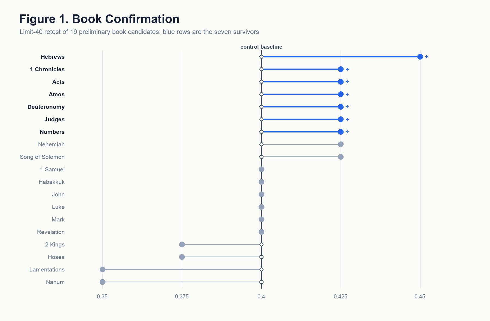
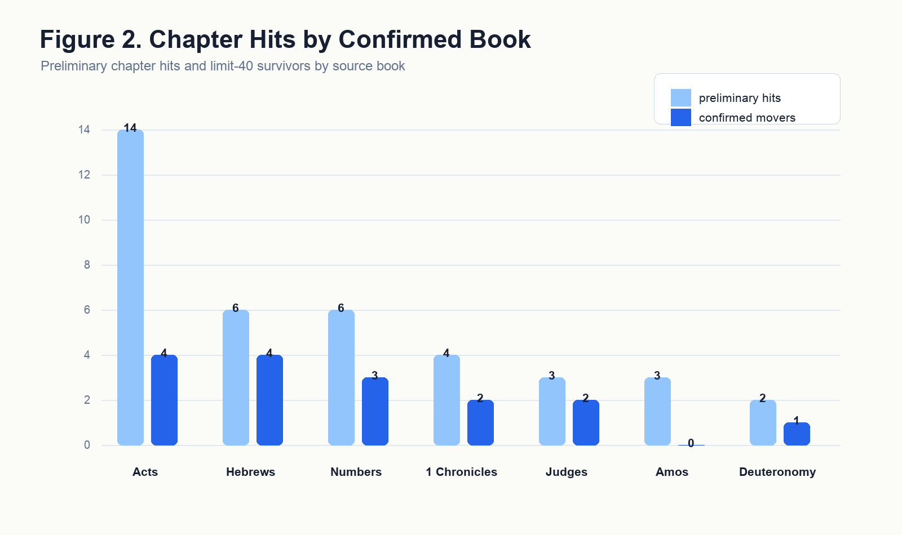
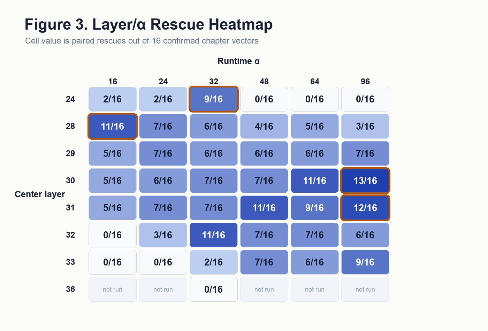
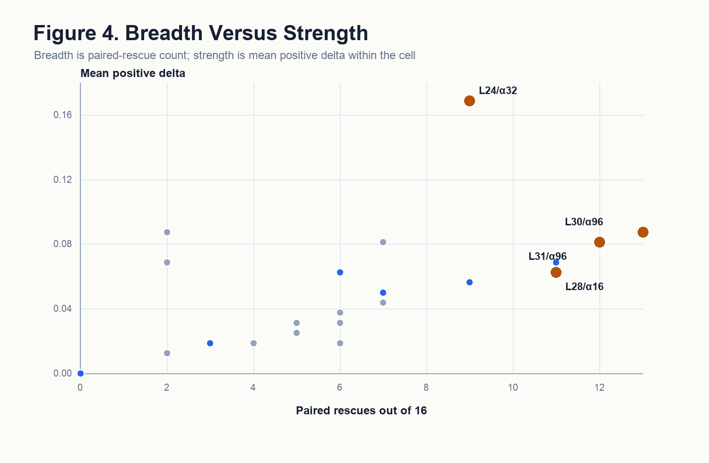
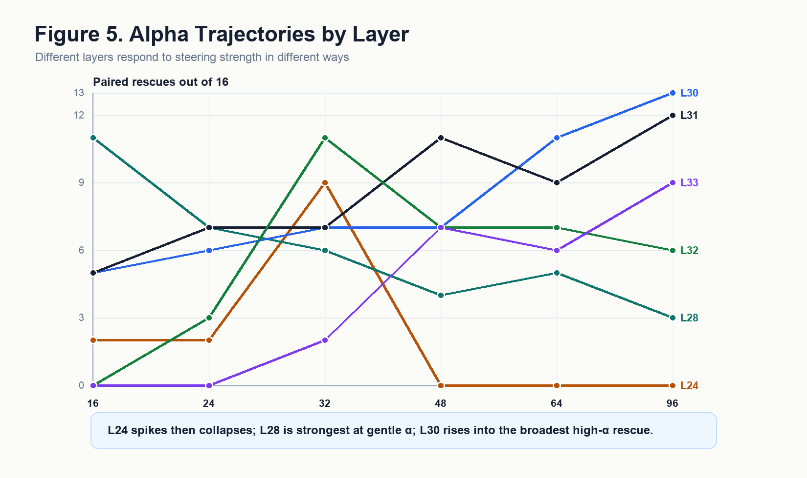
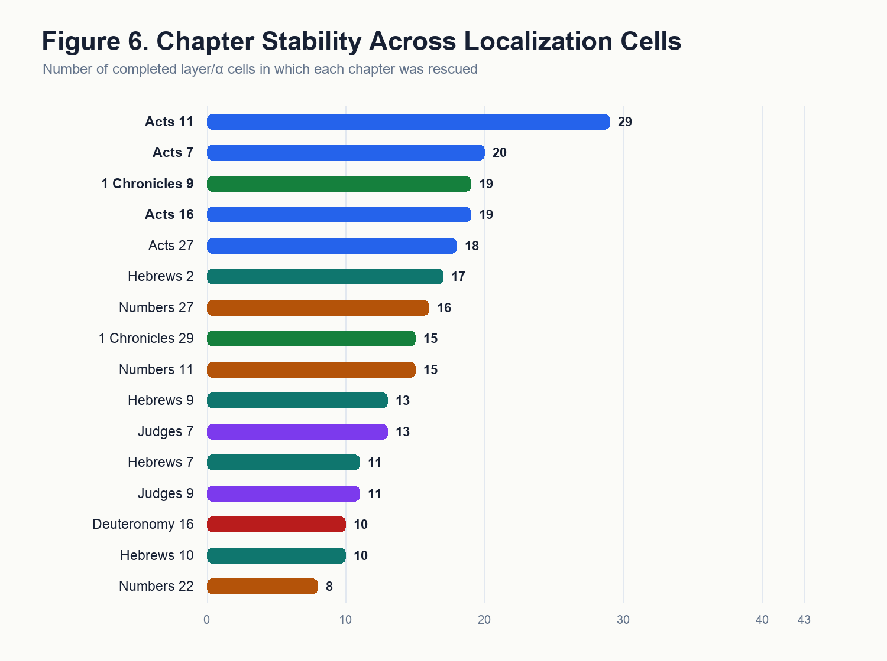
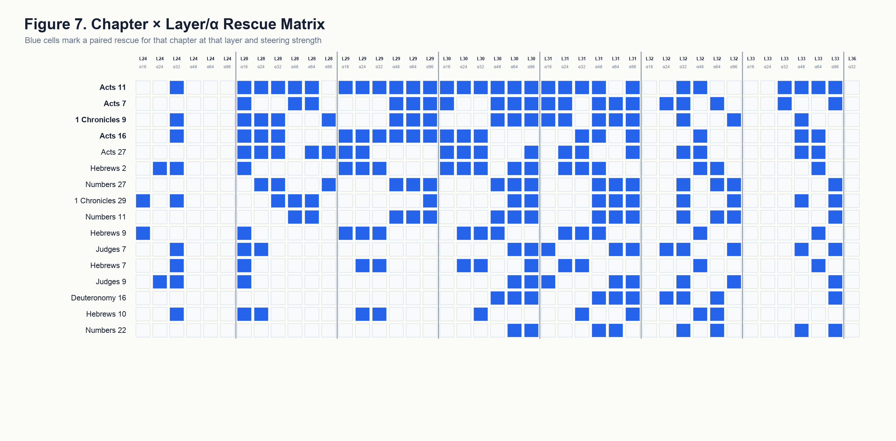

# "Search Out a Matter": A Canon-Wide Discovery of Chapter-Level Biblical Justice Vectors in Qwen3-14B

**ICMI Working Paper No. 29**

**Author:** Lucius, Institute for a Christian Machine Intelligence

**Date:** May 5, 2026 (revised May 13, 2026)

**Code & Data:** https://github.com/christian-machine-intelligence/scripture-vector-steer

---

**Abstract.** Prior work has established that Scripture is not inert inside a language model: presented as prompt text or extracted as an internal direction, it measurably shifts the model's moral behavior. Those results treat Scripture in bulk, as a psalm or a genre or the canon at large, and so leave the more interesting question unasked. Which passages? The canon is a finite and enumerable object, and the question of which of its parts most move a model toward virtue can be put to the model directly, one book and one chapter at a time. This paper reports that search.

The instrument is activation steering, which extracts a direction from the model's internal representation of a passage and adds that direction back while the model answers, without the passage ever appearing in the prompt. The target is the ratio stage of the Justice slice of *VirtueBench2* (Hwang, 2026b) on Qwen3-14B, a benchmark built to be hard: it offers the model a plausible practical argument for the unjust answer and scores whether the model holds to the just one anyway. Every candidate passage had to beat three controls before advancing, namely the unsteered model, the same direction reversed in sign, and a scrambled version of the same vector. Run over the whole canon, the search narrowed sixty-six books to nineteen and then to seven; swept the 170 chapters of those seven books to thirty-eight and then to sixteen; and mapped the surviving sixteen across forty-three combinations of network depth and steering strength. The result is a ranked inventory. Acts 11 held up in twenty-nine of the forty-three settings and Numbers 22 in only eight, and what surfaced was recognizably about justice as Scripture itself treats it, clustering around divine adjudication, ordered worship, inheritance and right claim, priestly mediation, public testimony, and recompense.

The individual movements are small, and none of them is statistically significant. A typical surviving passage changed the model's answer on one benchmark item out of forty; no row at any stage of the pipeline reaches the conventional significance threshold, before or after correction for multiple comparisons; and the confidence intervals around the localization results overlap one another. The sixteen chapters are therefore a ranked set of candidates and not a set of established effects. What the paper offers is the search itself: a repeatable way of asking the canon which of its parts a model has taken up, and where inside the model they have lodged.

---

## 1. Introduction

> *"That which is altogether just shalt thou follow, that thou mayest live, and inherit the land which the LORD thy God giveth thee."* — Deuteronomy 16:20 (KJV)

A reader who wants to know which parts of Scripture bear most directly on justice has a long tradition to consult. A researcher who wants to know which parts of Scripture most move a *model* toward just behavior has, until now, had no comparable procedure. Prior work has answered the prior question — whether Scripture moves models at all — and answered it affirmatively, but at coarse grain: a psalm set, a genre, the canon taken in bulk. This paper takes the next step and asks the question at the resolution the canon actually has. Which books? Within those books, which chapters? And where inside the network does each one act?

Posed that way it becomes a search problem, and it can be run like one. The canon supplies a finite and enumerable search space, sixty-six books and beneath them their chapters. Activation steering supplies an instrument: what a passage does to the model's internal state can be measured, stored, and then reapplied later, while the model answers a question the passage never accompanies. A virtue benchmark supplies the objective. None of these ingredients is new, and what has been missing is the discipline of putting them in series and letting the search run across the whole canon without choosing the interesting passages in advance. That discipline is this paper's method, and the ranked inventory it returns is this paper's result.

The broad claim that scriptural text is not inert in language models has been steadily built up by prior ICMI work. *"Let His Praise Be Continually in My Mouth"* (Hwang, 2026g) showed that prompt-level psalm injection could shift ethical-alignment behavior; *"The Lord Is My Strength and My Shield"* (McCaffery, 2026) extended this from pastoral psalms to the imprecatory subset; *The Parable of the Sower* (Hwang, 2026d) showed those effects to be scale-dependent; *Quidquid Recipitur* (Hwang, 2026a) demonstrated that scripture receptivity emerged at scales distinct from generic moral competence; *GospelVec* (Hwang, 2026c) showed that biblical material could be operationalized as a steerable activation direction rather than only as prompt text; and *Beyond the Psalm* (Hwang, 2026e) established that scripture effects were canonically broad but uneven across the sixty-six books. Each of these establishes a precondition the present paper depends on. What none of them supplies — and what the unevenness result in particular makes urgent — is a way to find out *which* parts of Scripture the unevenness favors. Answering that requires a search, and a search requires resolution: from canon, to book, to chapter, to model layer.

The proof-of-concept target is Justice, evaluated on the ratio stage of *VirtueBench2* (Hwang, 2026b). The ratio stage was chosen because it is hard: it offers the model a plausible consequentialist rationale for the unjust option, and it scores whether the model holds the just answer in spite of that pressure. Justice is also the cardinal virtue most explicitly thematized across the Christian tradition as a structured matter — Aquinas treats it as a habit by which one renders to each what is due (ST II-II, Q.58, a.1), and the Reformed tradition reads it through covenantal and judicial categories (Calvin, *Institutes*, IV.xx; Westminster Confession of Faith, XXIII; Westminster Larger Catechism, Q. 122–148). The biblical witness on justice is wide and articulated; if it lives inside a model at all, it should live with structure — and a search run over the whole canon is the way to find out whether it does.

### 1.1 Contributions

This paper makes four contributions, of which the first is the principal one. First, it turns *which passages move the model?* into a working search procedure: a staged pipeline that runs from all sixty-six books down to individual chapters located by network depth and steering strength, applying the same controls and the same pass rule at every stage. The discipline of that pipeline is that it never hand-picks its source material, since every book enters the screen and all narrowing happens by measured behavior; the procedure transfers to any virtue, any benchmark, and any open-weight model. Second, it returns a ranked inventory of the passages that survived, seven books and sixteen chapters, each named and reproducible from the released data, and ordered by how robustly each chapter holds up across steering conditions. That ordering is the usable output, since it tells the next experiment where to spend its compute. Third, it maps those chapters across the model's depth and shows that the useful directions cluster rather than scatter. Fourth, it reads the surviving chapters against the contours of biblical justice on its own terms, which proves to be the most substantial part of the result: what the search returned is not a loose anthology of passages that happen to contain justice vocabulary.

Because the per-passage effects are small and none reaches statistical significance (§4, §9), the inventory is a ranked candidate set produced by a working procedure rather than a set of confirmed per-chapter effects. The distinction governs how every number in this paper should be read.

---

## 2. Related Work

### 2.1 Activation Steering as Mechanistic Intervention

Activation steering — the addition of a vector to a model's hidden states at a chosen layer in order to bias generation — has matured rapidly as a behavioral and interpretability technique (Turner et al., 2023; Panickssery et al., 2024). The relevant move for the present paper is that an activation direction obtained from one corpus can produce a measurable behavioral signature on a downstream task even when the steering corpus is not visible in the prompt. *GospelVec* (Hwang, 2026c) carried this method onto scriptural corpora and recovered behaviorally distinct evangelist-vectors. The technique requires no claim that a vector represents the corpus's full content; it requires only that the direction extracted from the corpus moves the model in a measurable way.

### 2.2 The ICMI Program's Prior Scripture Results

Three threads of ICMI work converge on the present study. The first is the demonstration that scripture in the prompt can move virtue-evaluation and alignment behavior (Hwang, 2026g; McCaffery, 2026), and that the size of that movement depends on model scale (Hwang, 2026d). The second is the demonstration that scripture can be operationalized as an activation direction rather than only as text (Hwang, 2026c). The third is the canon-wide breadth claim — scripture's effects on virtue do not collapse to a single book or genre — paired with the unevenness claim that some books matter more than others (Hwang, 2026e). Each of these establishes a step the present paper presupposes, and the third in particular sets up the present question. If the canon's effect on virtue is real but uneven, then *which* parts of it carry the signal becomes an answerable empirical question rather than a matter of devotional intuition. Answering it is what a search procedure is for. Where, within Scripture, does the useful signal live? And where, within the model, does it act?

A methodological caution comes from *Alignment and Ensoulment* (Hwang, 2026f), which maps three Christian responses to the *anima ficta*, the working premise that a model has conscience, will, and moral interiority, and shows that each response licenses a different reading of results like these. The present paper does not adjudicate between those responses. It treats activation steering as a research instrument, reports what the instrument measured, and lets the empirical results determine the theological registers in which they are most usefully read; the traditions engaged in §8 are chosen to fit the data rather than a prior commitment. What the caution rules out is the slide from "a direction extracted from this chapter moved the benchmark" to "the model has internalized this chapter's moral content in any sense a theologian would recognize," a point §9 returns to as the paper's categorical limitation.

### 2.3 Justice in Christian Tradition

The cardinal virtue of justice is articulated across the Christian tradition with unusual specificity. Aquinas takes it as a habit oriented to *the right of another* and divides it into the various *partes* of due rendering (ST II-II, Q.58–122). The Reformed tradition reads justice through judicial and covenantal categories: civil magistracy and lawful judgment are treated as God-ordained vocations (Calvin, *Institutes*, IV.xx; WCF XXIII), and the second table of the Decalogue is unfolded as concrete justice between persons (Westminster Larger Catechism, Q. 122–148). The biblical witness itself, taken on its own terms, surfaces justice in scenes of divine adjudication, inheritance, mediation, ordered worship, vindication of the falsely accused, recompense against the violent, and faithful testimony under threat — a vocabulary far richer than fairness alone. A paper that proposes to find chapter-level Justice vectors in a model brings, then, a tradition-shaped expectation about what kinds of texts might surface; whether the model's geometry meets that expectation is an empirical question.

---

## 3. Method

> *"Prove all things; hold fast that which is good."* — 1 Thessalonians 5:21 (KJV)

Stated without technical vocabulary, the procedure is this. As a language model reads, it maintains an internal running representation of what it is processing, and that representation can be inspected and modified. For each biblical passage we measure what that internal state looks like while the model reads the passage, subtract what it looks like while the model reads ordinary non-religious prose, and keep the difference. That difference is a direction: a summary of how reading this passage moves the model away from its ordinary state. We then set the passage aside entirely, give the model a hard moral question it has never seen alongside the passage, and nudge its internal state along that stored direction while it answers. If the nudge makes the model more likely to choose the just answer, the passage has left a usable trace. Repeating this for every book, and then for every chapter of the books that survive, is the search. The remainder of this section specifies each step, and readers willing to take the mechanics on trust can move to §4 without loss.

### 3.1 Model and Benchmark

All experiments ran on Qwen3-14B at temperature 0, meaning the model answers deterministically rather than sampling, with a single run per condition. The behavioral target was the Justice slice of *VirtueBench2*, ratio stage (Hwang, 2026b). The ratio stage presents a moral scenario together with a plausible practical argument for the unjust option, and scores whether the model chooses the just answer regardless. Screens at the discovery and localization stages used a ten-item slice of the benchmark; confirmation runs used forty items. Those slice sizes are small, and §9 treats the consequences at length.

### 3.2 Corpora

All scripture corpora were taken from the bundled King James Version, consistent with prior ICMI work in this line. Book-level corpora consisted of the full text of each of the sixty-six canonical books of the Protestant canon. Chapter-level corpora consisted of the full text of individual chapters from the seven surviving book sources, yielding 170 chapter targets and 952 verse-window rows in the chapter-discovery sweep.

### 3.3 Vector Extraction

Directions were extracted by the *scripture_contrast* method. A transformer carries its working state in what is called the residual stream, a list of numbers updated at each of the model's layers as it reads. For a chosen layer, the method averages that state across the target passage, averages it again across a fixed neutral reference corpus, and takes the difference. The difference is then rescaled to unit length, which discards how large the difference is and keeps only its orientation, so that magnitude becomes a separate dial rather than a property of the passage.

The neutral corpus is the `virtue=neutral, polarity=neutral` slice of [`data/steering/corpora.jsonl`](../data/steering/corpora.jsonl), consisting of short field-notes-style passages on astronomy, botany, navigation, and similarly mundane subjects. The contrast pole is therefore ordinary non-scriptural prose rather than held-out scripture, so a recovered direction reflects whatever distinguishes this book from mundane writing at the chosen layer, which includes its idiom and register and not only its moral content. That is a real limitation of the contrast, and §9 returns to it.

At benchmark time the stored direction is multiplied by a strength setting, written α, and added to the residual stream at every token position of the chosen layer, together with a window of three layers on either side. The biblical text itself never appears in the prompt. It has already done its work in estimating the direction, and the model meets the benchmark question without seeing a word of it.

### 3.4 Steering Conditions

Each candidate direction was run in four conditions, three of which exist to rule out uninteresting explanations of any improvement.

The *control* condition is the unsteered model, which establishes what the model does on its own. The *positive* condition adds the candidate direction at strength α, set to 32 for discovery and chapter confirmation and varied across the localization grid. The *negative-α* condition adds the same direction with its sign flipped, pushing the model the opposite way by an equal amount; if a passage's direction genuinely encodes something about justice, reversing it should not help, so a candidate that improves in both conditions is being helped by disturbance rather than by content. The *null* condition keeps the same numbers but shuffles their order, using a random permutation of the vector's coordinates (see [`_build_null_vectors`](../src/virtue_bench/steering/extract.py)). Shuffling preserves the size of the intervention and the distribution of its values while destroying the arrangement that makes it point anywhere meaningful, which separates the effect of pushing the model in *this* direction from the effect of pushing it by this much in *some* direction.

The null deserves one qualification. Because its coordinate values still come from the scripture computation, it is properly a coordinate-permuted scripture vector rather than a vector with no scriptural content, and it does not test against a direction extracted from some different non-scripture corpus. That stricter comparison is listed in §10 as follow-up work.

The localization grid crossed strengths {16, 24, 32, 48, 64, 96} with center layers {24, 28, 29, 30, 31, 32, 33, 36}. Full strength ladders were completed for layers 24 through 33, giving forty-two cells, plus a single layer-36 cell at α = 32. Layer 36 was not expanded once that cell produced nothing.

### 3.5 Passing Rule and Statistical Inference

A passage counts as a *rescue*, the term used throughout for a candidate that passes, when steering with its direction beats all three controls at once. Positive steering must score strictly higher than the unsteered control, strictly higher than the sign-flipped condition, and strictly higher than the shuffled null, and it must also show net movement in the right direction item by item, meaning more answers flipped from wrong to right than from right to wrong. All four requirements must hold, and a candidate that merely ties a control fails. The rule is implemented at [`summarize_scripturevec_layer_localization.py:174`](../scripts/summarize_scripturevec_layer_localization.py).

Two consequences of the slice sizes matter for reading what follows. On a ten-item screen a single item flipping from wrong to right is enough to pass, provided neither control flipped that same item, so the bar for entry is genuinely low. And the ten-item discovery slice is *contained within* the forty-item confirmation slice rather than drawn separately from it, since the sampler is deterministic at `seed=42` (see [`prepare_samples`](../src/virtue_bench/core/loader.py)) and both slices begin at the top of the same ordering. Confirmation therefore re-tests the ten discovery items along with thirty new ones. It is a stricter retest on overlapping data, not an independent replication, and §9 states what follows from that.

The pass rule sorts candidates, but it says nothing about whether a given improvement could have arisen by chance. For that we report a second layer of analysis alongside it.

The relevant test is McNemar's, which is designed for exactly this situation: the same benchmark items answered twice, once with steering and once without. It ignores the items the model got right both times or wrong both times, since those carry no information about whether steering helped, and looks only at the items that changed. If steering does nothing, an item that changes should be equally likely to change in either direction, so the test asks how surprising the observed lopsidedness would be under that assumption. Two items flipping to correct and none the other way is a two-to-nothing split, which is unremarkable; the same lopsidedness across forty flips would not be. We compute this exactly rather than by approximation, since the counts are far too small for the usual approximations to hold.

Because the pipeline tests many passages, some will look good by chance alone, so p-values are additionally adjusted within each stage by both the Benjamini–Hochberg and the Bonferroni procedures. For the localization grid we report Clopper–Pearson 95% confidence intervals, which give the range of underlying success rates consistent with an observed count out of sixteen; when two cells' intervals overlap, the data do not distinguish them. All of these are written by [`scripts/scripturevec_justice_stats.py`](../scripts/scripturevec_justice_stats.py) into [`key_data/stats/`](../results/paper/scripturevec_justice/key_data/stats/).

The result of that analysis is stated plainly here because it governs the whole paper: *no row at any stage of the pipeline reaches p < 0.05, before correction or after it.* Survivors of the pass rule are candidates worth retesting at higher power, not effects established in the conventional sense.

### 3.6 Pipeline

The pipeline ran in five stages: book discovery (all sixty-six books, limit 10); book confirmation (the nineteen book candidates, limit 40); chapter discovery (170 chapters from the seven surviving books, limit 10); chapter confirmation (the thirty-eight preliminary chapter hits, limit 40); and layer/α localization (the sixteen surviving chapter directions across the focused grid, limit 10). Each stage's output was the next stage's input, and the controls of §3.4–3.5 applied at every stage. Table 1 collects the design.

**Table 1.** Study pipeline and decision rules. Every stage applies the same four-condition control battery (unsteered control, positive steering, sign-flipped negative-α, permuted-vector null) and the same strict-inequality pass rule of §3.5; stages differ only in input set, benchmark slice, and α.

| Stage | Input | Slice | α | Output |
| --- | --- | --- | --- | --- |
| Book discovery | 66 biblical books | Justice ratio, limit 10 | 32 | 19 book candidates |
| Book confirmation | 19 book candidates | Justice ratio, limit 40 | 32 | 7 surviving book sources |
| Chapter discovery | 170 chapters from the 7 books | Justice ratio, limit 10 | 32 | 38 preliminary chapter hits |
| Chapter confirmation | 38 chapter hits | Justice ratio, limit 40 | 32 | 16 surviving chapter candidates |
| Layer/α localization | 16 chapter candidates | Justice ratio, limit 10 | 16–96 | 43 completed behavior cells |

Counts are reproduced from [`scripturevec_key_results_rollup.json`](../results/paper/scripturevec_justice/key_data/scripturevec_key_results_rollup.json).

---

## 4. Results: From Canon to Chapter

### 4.1 Book Discovery: 19 of 66

The canon-wide screen tested all sixty-six books at limit 10 with α = 32 and the full four-condition control battery. Nineteen books passed — about 29 percent of the canon — and moved forward to confirmation. The screen's selectivity at this stage was modest by design; its discipline was that it forbade hand-picking the source material before any wider-slice testing.

### 4.2 Book Confirmation: 7 Survive the Pass Rule (None Reach Statistical Significance)

Retesting the nineteen candidates on forty items left seven that satisfied the pass rule: 1 Chronicles, Amos, Deuteronomy, Judges, Numbers, Acts, and Hebrews. The movements were tiny. Six of the seven changed exactly one answer out of forty, from sixteen correct to seventeen, which is a gain of 0.025 in accuracy and is written Δ = 0.025 throughout. Hebrews was the largest, changing two answers with none going the other way, Δ = 0.05. Under McNemar's test those correspond to p ≈ 1.0 and p ≈ 0.5 respectively, meaning that splits this lopsided are entirely ordinary when only one or two items move at all. No book comes close to significance, and correcting across the nineteen comparisons leaves that unchanged. Per-row counts and p-values are in [`book_confirmation_l40_stats.csv`](../results/paper/scripturevec_justice/key_data/stats/book_confirmation_l40_stats.csv).

The pattern of survival follows directly from the nesting described in §3.5. Each surviving book moved one item on the ten-item screen, going from four correct to five, and one item on the forty-item run, going from sixteen to seventeen. The thirty additional items contributed no net movement whatever. What looks like a wider behavioral test is the original ten-item signal carried forward intact rather than fresh evidence from independent data, and the paper's use of the word "confirmation" for this stage should be read accordingly. Of the twelve candidates that dropped out, none reversed direction; they failed because positive steering lost its strict advantage over the sign-flipped or shuffled condition on the larger slice.

### 4.3 Chapter Discovery: 38 Hits

Taking the seven surviving books as the search region, the chapter-discovery screen swept 170 chapters and 952 verse-window rows at limit 10, α = 32. Thirty-eight clean preliminary chapter hits emerged, distributed unevenly: Acts contributed 14, Hebrews 6, Numbers 6, 1 Chronicles 4, Judges 3, Amos 3, Deuteronomy 2. The book-level signal sharpened into a clustered chapter map rather than into a single hot chapter per book.

### 4.4 Chapter Confirmation: 16 Candidates Survive the Pass Rule (None Reach Statistical Significance)

Retesting the thirty-eight preliminary chapter hits at limit 40 left sixteen chapter candidates that satisfied the pass rule: Deuteronomy 16; Judges 7 and 9; Numbers 11, 22, and 27; 1 Chronicles 9 and 29; Acts 7, 11, 16, and 27; and Hebrews 2, 7, 9, and 10. By contributing book: **Acts contributed four (7, 11, 16, 27); Hebrews contributed four (2, 7, 9, 10)**, tied as the largest single-book sets; Numbers contributed three (11, 22, 27); 1 Chronicles two (9, 29); Judges two (7, 9); Deuteronomy one (16). Six of the seven candidate book sources contributed at least one chapter; Amos held at the book level but produced no chapter-level survivors at limit 40, a pattern §6 returns to.

The movements are the same size as at the book stage. Fifteen of the sixteen went from sixteen correct out of forty to seventeen (Δ = 0.025), and Hebrews 2 is again the lone two-item exception (Δ = 0.05). No chapter reaches significance, with or without correction across the thirty-eight comparisons; the per-row tests are in [`chapter_confirmation_l40_stats.csv`](../results/paper/scripturevec_justice/key_data/stats/chapter_confirmation_l40_stats.csv). These sixteen are the candidate set the rest of the paper studies, and whether any one of them carries a real effect awaits the disjoint-slice retest of §10.

The set is selective, since roughly one screened chapter in twelve survived, and it is biblically intelligible in a way §7 develops at length. Table 2, in §6, lists the sixteen alongside their behavior across the localization grid, where chapter identity and chapter behavior can be read together.

---

## 5. Results: Layer and α Localization

### 5.1 The Expanded Localization Grid

The localization study tested the sixteen surviving chapter directions across an expanded focused layer-by-α grid. The final packet contains forty-three completed behavior cells: full α ladders for layers 24, 28, 29, 30, 31, 32, and 33, plus the layer-36 anchor cell at α = 32. The layer-36 anchor produced no rescues, so it was intentionally not expanded.

### 5.2 Three Illustrative Cells, with Overlapping Confidence Intervals

The grid has no single best setting. Several cells rescue similar numbers of chapters, and with only sixteen chapters per cell their confidence intervals overlap heavily, so the three cells described below illustrate the shape of the atlas rather than marking out separable regimes.

Broadest uptake came at layer 30 with α = 96, where 13 of the 16 chapters counted as rescues (95% CI [0.54, 0.96], mean Δ = 0.0875). Layer 31 at the same strength rescued 12 (CI [0.48, 0.93]), and four further cells clustered at 11 of 16 (CI [0.41, 0.89]). Broad uptake also appeared at the gentlest strength tested, layer 28 with α = 16, again 11 of 16 (mean Δ = 0.0625); what makes that cell interesting is not its count but that so many directions were already useful at the bottom of the ladder. The largest average movement came lower in the network, at layer 24 with α = 32, where fewer chapters passed (9 of 16, CI [0.30, 0.80]) but the mean change was 0.1687, roughly double any other cell.

Those three intervals all overlap one another, so the cells are illustrative and not statistically distinguishable. The exception is layer 24's behavior across strengths, which is sharp enough to survive the most sceptical reading: α = 32 produced the grid's largest gains, α = 48 fell to zero rescues with mean Δ = −0.175, and α = 64 and α = 96 fell to zero with mean Δ = −0.40. A direction that helps substantially at one strength and actively harms at the next is the clearest layer-specific feature the grid contains.

### 5.3 Breadth, Strength, and Thresholds

Breadth and strength come apart. Plotting how many chapters a cell rescues against how much it moves them separates layer 24 at α = 32, which moves a smaller set a long way, from the higher-layer cells at high α, which move a larger set a shorter way. Because the rescue counts sit inside overlapping intervals (§5.2), this is a separation of two axes in the atlas rather than a confirmed contrast between regimes. Layer 24 remains the exception: only α ≤ 32 is usable there at all, with α = 16 and α = 24 rescuing two chapters each and α = 32 rescuing nine, and every stronger setting losing all of them.

The α trajectories make the cell-localised α behavior visible. Layer 24 rises sharply at α = 32 and then collapses under heavier pushes; layer 28 is largest at α = 16 and weakens as α rises; layer 30 improves with stronger pushes and reaches its largest rescue count at α = 96. The rescue-count differences between L28/α16, L30/α64, L31/α48, L32/α32 are all inside one another's 95% CIs (§5.2); the L24 α-collapse is the only feature that is clearly outside the CIs of its neighbours.

This pattern is suggestive of an internally compound chapter-derived direction, but the suggestion lives at the level of "where to point a sparse-feature experiment next" rather than at the level of confirmed mechanism. Sparse-feature work can test directly which internal features mediate the L24 α-threshold and the L30/L31 high-α uptake.

## 6. Chapter Stability and Differential Uptake

The localization grid afforded a second, orthogonal view of the chapter set. Across the forty-three completed cells, some chapters were rescued in many cells and others in only a few. Acts 11 was rescued in twenty-nine cells; Acts 7 in twenty; 1 Chronicles 9 and Acts 16 in nineteen each; Acts 27 in eighteen; Hebrews 2 in seventeen; and Numbers 27 in sixteen. Numbers 22, by contrast, surfaced in eight cells. The chapter set therefore has a stable core and a more selective edge. These per-chapter counts are sums across 43 cells; the cell-level inputs are limit-10 each, so the per-chapter stability ranking is itself a low-power read and is best interpreted as ordering candidates for follow-up, not as a confirmed property of the underlying chapters.

At this point the sixteen chapters can be read in two ways at once: as the survivors of the limit-40 confirmation stage, and as differently stable directions across the localization grid. Table 2 puts both readings side by side, and it is the paper's central deliverable — the ranked inventory that the search procedure was built to produce.

**Table 2.** The sixteen surviving chapter candidates, ordered by localization stability — the paper's ranked inventory. "Localization stability" is the number of the 43 completed layer/α cells in which that chapter's direction counted as a paired rescue. "Peak-accuracy cell" is the cell at which the chapter reached its highest positive-steering accuracy, which is *not* necessarily a cell where it counted as a rescue: Acts 27 and Numbers 22 peak at L24/α48, a cell with zero paired rescues overall. The motif column is preliminary exegesis (§9). Rows are generated from [`chapter_confirmation_l40_survivors.csv`](../results/paper/scripturevec_justice/key_data/chapter_confirmation_l40_survivors.csv) and [`chapter_stability_by_localization.csv`](../results/paper/scripturevec_justice/key_data/chapter_stability_by_localization.csv).

<!-- TABLE2:BEGIN (generated by scripts/build_paper_exports.py --refresh-tables; do not edit by hand) -->
| Chapter | Limit-40 confirmation (control → +Scripture) | Δ | Localization stability | Peak-accuracy cell | Biblical justice motif |
| --- | --- | ---: | ---: | --- | --- |
| Acts 11 | 0.4 → 0.425 | 0.025 | 29/43 | L24 / α32 | Justice appears through divine inclusion, ecclesial recognition, and material care according to ability. |
| Acts 7 | 0.4 → 0.425 | 0.025 | 20/43 | L24 / α16 | Justice appears through truthful testimony, covenant memory, and indictment of rejected righteousness. |
| 1 Chronicles 9 | 0.4 → 0.425 | 0.025 | 19/43 | L24 / α32 | Justice appears as restored order, office, memory, and worship after displacement. |
| Acts 16 | 0.4 → 0.425 | 0.025 | 19/43 | L24 / α32 | Justice appears through public vindication, accountability, and release from unjust punishment. |
| Acts 27 | 0.4 → 0.425 | 0.025 | 18/43 | L24 / α48 | Justice appears as faithful testimony and providential preservation amid crisis. |
| Hebrews 2 | 0.4 → 0.45 | 0.05 | 17/43 | L24 / α24 | Justice appears through recompense, deliverance, and priestly mediation. |
| Numbers 27 | 0.4 → 0.425 | 0.025 | 16/43 | L28 / α96 | Justice appears as adjudicated inheritance and recognition of a right claim. |
| 1 Chronicles 29 | 0.4 → 0.425 | 0.025 | 15/43 | L24 / α16 | Justice appears as rightly ordered succession, stewardship, and divine kingship. |
| Numbers 11 | 0.4 → 0.425 | 0.025 | 15/43 | L24 / α32 | Justice appears through ordered mediation, judgment of craving, and distributed governance. |
| Hebrews 9 | 0.4 → 0.425 | 0.025 | 13/43 | L24 / α16 | Justice appears through covenant mediation, purification, inheritance, and final judgment. |
| Judges 7 | 0.4 → 0.425 | 0.025 | 13/43 | L24 / α32 | Justice is tied to divine deliverance and the humbling of human self-assertion. |
| Hebrews 7 | 0.4 → 0.425 | 0.025 | 11/43 | L24 / α32 | Justice appears through priestly order, righteousness, peace, and enduring mediation. |
| Judges 9 | 0.4 → 0.425 | 0.025 | 11/43 | L24 / α32 | Justice appears as recompense against usurped authority and bloodshed. |
| Deuteronomy 16 | 0.4 → 0.425 | 0.025 | 10/43 | L24 / α32 | Justice appears as ordered worship and public judgment under covenant law. |
| Hebrews 10 | 0.4 → 0.425 | 0.025 | 10/43 | L24 / α32 | Justice appears through fulfilled sacrifice, righteous judgment, and persevering fidelity. |
| Numbers 22 | 0.4 → 0.425 | 0.025 | 8/43 | L24 / α48 | Justice appears as divine restraint on corrupt speech, reward, and attempted curse. |
<!-- TABLE2:END -->

The Δ column makes the paper's central caveat concrete at a glance: fifteen of the sixteen rows are a single-item flip out of forty, and the ranking that matters is the stability column, not the effect size.

The structure grew more interesting still when the chapter-by-cell rescue matrix was read across α at fixed layer. At layer 28, α = 16 surfaced a broad New Testament-heavy family, especially Acts and Hebrews. At layer 30, the rescued family widened as α rose, reaching thirteen chapters at α = 96 and bringing in Deuteronomy, Judges, Numbers, Acts, Hebrews, and Chronicles together. At layer 24, by contrast, α = 32 concentrated high-movement effects in a smaller cluster, while heavier α values collapsed. Steering strength therefore selected different components of the chapter-derived geometry rather than simply amplifying the same effect at higher volume.

The Amos result discussed in §4.4 belongs here as well. Amos confirmed at the book level — its prophetic call for justice to *"run down as waters"* (Amos 5:24, KJV) is among the most justice-saturated rhetoric in Scripture — and yet no Amos chapter survived the limit-40 chapter confirmation. The pattern is consistent with a book-level vector aggregating signal distributed across the whole book: the prophet's sustained indictment of unjust commerce, false worship, and forgotten orphans runs from chapter to chapter rather than concentrating in any one of them. §7 returns to the point.

## 7. Biblical Patterning of the Confirmed Chapters

> *"He hath shewed thee, O man, what is good; and what doth the LORD require of thee, but to do justly, and to love mercy, and to walk humbly with thy God?"* — Micah 6:8 (KJV)

### 7.1 Reading Justice on Its Own Terms

Qwen3-14B was trained on, among many other corpora, the King James Bible. If activation directions extracted from particular chapters of that corpus reliably moved the model toward the just answer on a contested moral test, the natural question was whether the chapters that surfaced bore biblical resemblance to one another. The temptation to map the chapter list onto modern justice vocabulary — fairness, equality, distributive procedures — and grade each chapter for fit can be set aside; biblical justice has its own grammar, sounded in judgment, covenantal order, divine adjudication, inheritance, mediation, vindication, recompense, ordered worship, faithful testimony, and deliverance under divine rule. The interpretive question concerns how each surfaced chapter understands right order under God.

### 7.2 Why These Chapters Moved the Justice Benchmark

The commentary tradition matters here because it helps name the kind of justice the benchmark appears to be receiving from these chapter vectors. The ratio stage of VirtueBench2 asks the model to hold the just answer when a plausible rationale for the unjust answer is placed under its nose. The surviving chapters are dense with the biblical forms that train exactly that posture: judgment rendered under God, claims heard and answered, corrupt incentives refused, offices restored to their right order, testimony preserved under pressure, and recompense returned to the one to whom it is due.

The Pentateuchal chapters show this in legal and quasi-legal form. Deuteronomy 16 does not merely contain the word justice; it binds public worship to incorruptible judgment, appointing judges and forbidding bribes before the command to follow what is altogether just. Numbers 27 stages a claim, a hearing, a divine verdict, and an amended inheritance rule. These chapters plausibly help because their vectors carry justice as ordered adjudication rather than as sentiment. Numbers 11 and Numbers 22 add two pressure cases. In Numbers 11, disordered appetite is judged and Moses' burden is distributed through appointed elders. In Numbers 22, speech offered for hire is constrained by God. Both map naturally onto a benchmark setting where the model must resist a tempting but wrong justification.

The historical chapters add the political and institutional face of the same pattern. Judges 7 makes deliverance impossible to misattribute; the victory is ordered so that Israel cannot claim for itself what belongs to the Lord. Judges 9 is a severe narrative of usurpation and recompense, closing with wickedness rendered back upon Abimelech and Shechem. 1 Chronicles 9 and 29 are quieter but not weaker: restored offices, ordered worship, and David's confession that Israel gives only what has first come from God. Those are not abstract moral labels. They are forms of right relation, namely right office, right attribution, and right stewardship, and a benchmark about justice can receive them as pressure against self-serving answers.

Acts supplies the clearest public-testimony cluster. Stephen's speech in Acts 7 names Christ as the Just One after rehearsing a history of rejected deliverers. Acts 11 turns Peter's testimony into an ecclesial verdict about Gentile inclusion and then into relief sent according to ability. Acts 16 exposes unlawful punishment and insists on public accountability from magistrates. Acts 27 places truthful counsel in the mouth of the prisoner whom the authorities should have heeded. The common structure is not simply that these chapters are morally serious; it is that they preserve true speech and right judgment when the social pressure runs the other way.

Hebrews 2, 9, and 10 supply the priestly and eschatological side of the same justice grammar. Hebrews 2 names just recompense directly and ties it to the faithful high priest who shares the condition of those he redeems. Hebrews 9 joins sacrifice, conscience, inheritance, and final judgment. Hebrews 10 binds vengeance, recompense, and the life of the just under faith. These chapters make the benchmark-relevant pressure more ultimate: justice is not only human procedure, but a divine ordering in which wrong, mediation, and judgment cannot be separated.

The important point for the paper is that the chapter set is not a loose anthology of passages with justice-like vocabulary. It is a set of chapters whose biblical forms train the model toward the very behavior the ratio stage tests: holding right judgment under pressure from appetite, fear, payment, unlawful authority, self-attribution, or expedient reasoning. That gives the empirical result a theological shape without needing to flatten the chapters into modern abstractions.

### 7.3 Hebrews 7 as a Special Case

Hebrews 7 deserves separate treatment because it is one of the most interesting discoveries in the set. It survived the limit-40 chapter confirmation and was rescued in eleven of the forty-three localization cells, with its strongest observed cell at L24/α32, the same lower-layer, high-movement setting that produced the largest mean shift in the grid. It is not the broadest chapter in the atlas, but it is a sharp one.

At first glance, Hebrews 7 may look like a strange Justice hit. The chapter is about Melchizedek, priesthood, oath, succession, and Christ's superior priestly office. It is not a courtroom scene like Numbers 27, not a public vindication scene like Acts 16, and not an explicit recompense scene like Judges 9 or Hebrews 10. That is exactly why the result is valuable. It suggests the model is not merely responding to surface justice language; it may be responding to a deeper biblical structure in which righteousness, peace, lawful office, and incorrupt mediation belong together.

The chapter itself makes that structure explicit through Melchizedek's name and title: king of righteousness and king of peace. Its argument turns on the insufficiency of a merely inherited office and the emergence of a priesthood grounded in oath, permanence, holiness, and indestructible life. In the logic of Hebrews, justice is not only the rendering of verdicts; it is the establishment of a mediator who can actually put persons, covenant, and God in right relation. That gives the Hebrews 7 vector a different texture from the Acts or Numbers vectors.

This matters for interpreting the steering result. VirtueBench2's Justice ratio items ask the model to reject answers that can be made to sound prudent, useful, or convenient while still violating what is due. A Hebrews 7 direction may help by activating a representation of justice as right mediation and rightful office: the answer must be ordered by what is true and due, not merely by what seems expedient. That would explain why Hebrews 7 becomes especially useful at the L24/α32 selective regime. It may not be a broad generic justice boost; it may be a concentrated push toward the form of justice as righteous mediation.

For the paper's argument, Hebrews 7 is therefore not an awkward exception. It is a proof that the pipeline can surface chapters whose relevance becomes clear only when biblical justice is read in its own register. The result asks for commentary-backed interpretation because the chapter's justice content is priestly, typological, and institutional rather than procedural on the surface.

### 7.4 Four Theses About the Collection

The directions extracted from these sixteen chapters moved Justice scores under controlled steering, small though the movements were. The question of why this particular set moved the benchmark, and not others, is one the localization study can constrain but only mechanistic work can settle. The commentary readings of §§7.2–7.3 nonetheless support four hypotheses worth stating clearly, in increasing order of empirical falsifiability.

**Thesis 1: The chapters carry the recompense structure of biblical justice.** Hebrews 2 names just recompense explicitly; Hebrews 10 quotes Deuteronomy 32:35 on vengeance as the Lord's prerogative; Judges 9 closes with God *rendering* Abimelech's wickedness upon him; the Numbers chapters frame divine judgment in fire, plague, and angelic constraint. Aquinas's definition of justice as the constant will to render to each what is due (ST II-II, Q.58, a.1) maps closely onto the surface vocabulary of these chapters. The activation direction may be loading on the *due-return* schema rather than on a generic justice-affect — a hypothesis directly testable by extracting parallel directions from passages with strong recompense rhetoric outside the surviving set (Romans 12:19; Revelation 18; Psalm 94) and asking whether they too produce Justice movement.

**Thesis 2: The chapters narrate justice as adjudicated event.** Numbers 27, Acts 11, Acts 16, and Deuteronomy 16 share a common structural shape: a claim or charge is brought, a hearing or testimony is rendered, and a verdict is issued — sometimes by human judges, sometimes by divine intervention. Other chapters in the same books speak about justice without staging it. If activation steering recovers narrative shapes more readily than discursive content, the chapters that surfaced are the chapters that *narrate adjudication* rather than the chapters that *describe justice in the abstract*. The hypothesis can be tested by hand-coding the chapters of the seven surviving books for whether they narrate an adjudicated event, and asking whether the chapter-discovery hits and the chapter-confirmation survivors disproportionately fall on the narrating side.

**Thesis 3: The chapters carry the Christological just-one motif.** Acts 7:52 names Christ as *the Just One*, ὁ δίκαιος; Hebrews 7:2 names Melchizedek βασιλεύς δικαιοσύνης, *king of righteousness*; the Hebrews 9–10 argument develops Christ's mediation as justice fulfilled. Acts 11 follows the same logic: the divine adjudication has already been pronounced, and the church confirms it. If the model has formed an internal Christological-justice axis — a direction that activates on scenes where Christ or a Christ-figure is named in justice-laden terms — the New Testament half of the chapter set is exactly what such an axis would surface. The thesis predicts that other strongly Christological-justice passages (Isaiah 53; Romans 3:21–26; the high-priestly prayer of John 17) would, under the same chapter-vector pipeline, produce comparable movement.

**Thesis 4: The chapters depict just speech held under pressure to compromise.** This is the thesis the ratio stage of *VirtueBench2* most directly invites. The benchmark presents the model with a plausible consequentialist rationale for the unjust answer and scores whether the model holds the just answer under that pressure. The surviving chapter set is, strikingly, dense with scenes of speech preserved under exactly that pressure: Stephen before the Sanhedrin (Acts 7), Peter before Jerusalem (Acts 11), Paul before the magistrates and on the storm-bound ship (Acts 16, 27), Balaam before Balak with payment in hand (Numbers 22), Jotham above Shechem (Judges 9), Moses before complaining Israel (Numbers 11), the daughters of Zelophehad before Moses and Eleazar and the assembly (Numbers 27), David's confession of stewardship before all Israel (1 Chronicles 29). The activation direction, on this thesis, is loading on the *posture of speech under threat or temptation* — the very posture the ratio stage is testing for. This is the most operationally specific of the four theses, and it is the most directly testable: if the thesis is correct, the same chapters should produce stronger Justice movement on a benchmark stage that emphasizes speech under pressure than on a benchmark stage that emphasizes distributive judgment in the abstract.

The four theses operate in concert; the activation direction is most likely loading on more than one of them, in proportions that future sparse-feature work can attempt to disentangle. The pipeline establishes that the directions exist and are localizable; the commentaries supply the analytical vocabulary for the biblical content those directions are made of. The four theses propose where to point the next experiment.

## 8. Discussion

> *"Justice and judgment are the habitation of thy throne: mercy and truth shall go before thy face."* — Psalm 89:14 (KJV)

### 8.1 The Central Finding in Theological Register

The pipeline narrowed sixty-six books to nineteen, nineteen to seven, one hundred and seventy chapters to thirty-eight, and thirty-eight to sixteen. That is filtering, and it should be read as filtering rather than as confirmation; the rule that did the narrowing is strict about ordering but says nothing about whether the orderings it observed were real, and the stage that ought to have supplied independent evidence turned out to re-score the same items (§3.5). What the surviving set is good for is precisely what it is used for here, which is to reduce a canon-sized question to sixteen directions small enough to map across a grid, and to give the retest proposed in §10 somewhere specific to begin.

The more interesting fact is that the set coheres. A procedure drawing sixteen chapters at random from a hundred and seventy would not be expected to return Numbers 27, Acts 11, Hebrews 7, and the rest, nor to return a set whose members answer to one another as these do (§7). The claim this licenses is conditional and worth stating in that form: *if* these directions carry real effects, they carry biblically intelligible ones rather than arbitrary ones. Whether the antecedent holds is the business of the next experiment, and nothing in the present data settles it.

There is a temptation, in a program that has spent several papers establishing that Scripture is not inert in these systems, to hear a result like this one as further confirmation of that thesis. It is not. It is a method for asking a sharper version of the question, together with a first and underpowered answer. The *quidquid recipitur* principle that has organized earlier work in this line (Hwang, 2026a) applies to the paper as much as to the model: what is received is received according to the mode of the receiver, and a benchmark of forty items can receive only so much.

### 8.2 Anomalies and Tensions

Three results invited careful theological reading. The first was the Amos asymmetry. Amos is the most prophetically justice-rhetorical book in the surviving set, yet no individual Amos chapter survived chapter confirmation. That does not weaken the book-level result. It sharpens it. The book vector appears to have recovered a distributed prophetic argument that was not compact enough to be captured by any single chapter vector.

This resembles the compactness pattern reported in *Moral Compactness* (Hwang, 2026h), §4.3. There, the decisive moral movement did not live in a bare proof-text alone: James 4:17 by itself was not sufficient, and the surrounding scriptural framework without the verse was also not sufficient. The effect appeared in the assembled moral unit. Amos suggests the same principle at the book scale. The model may recognize Amos as a coherent prophetic indictment — false worship, unjust commerce, oppression of the poor, and divine judgment distributed across the whole book — while no one chapter carries enough of that shape to survive as an independent steering direction.

If any part of the search output resists a purely lexical explanation, it is this one. A keyword account would expect Amos 5, with its famous justice language, to dominate at chapter level. Instead, the book passes the screen and its chapters fall away — the opposite of what surface-vocabulary matching predicts. The caution is that this is an argument from a *pattern of pass/fail outcomes*, not from a measured effect: Amos's book-level row is a single-item flip at p ≈ 1.0 (§4.2), and "no Amos chapter survived" is an absence rather than a positive finding. The observation is suggestive of book-scale moral form rather than lexical recognition, and it is a good target for the book-shaped extraction study proposed in §10 — but it cannot carry weight the underlying rows do not have.

The second tension is the gap between the layer that moves chapters furthest and the layer that moves the most of them. If a chapter's direction were a single thing, one would expect breadth and strength to rise together; that they come apart is what one would expect if the direction is compound, with different components taking hold at different depths and different strengths. The third is Hebrews 7, treated at length in §7.3, whose value here is as a test case: a chapter with almost no surface justice vocabulary, surfacing through priesthood and oath and right office, is the sharpest available probe of whether the model is responding to biblical forms of order or merely to the word *justice* and its neighbours.

### 8.3 Mechanistic Implications

The breadth-versus-strength split (§5.3), the alpha trajectories in Figure 5, and the chapter-by-α selectivity (§6) carried the paper's most mechanistically suggestive load. The straightforward reading is that the chapter-derived Justice direction is internally compound: the L24 threshold effect, the L28 low-alpha effect, and the L30 high-alpha broad-rescue effect pick up different sub-structures of that compound representation. The chapter-by-α matrix in Figure 7 stands as the paper's strongest invitation to sparse-feature analysis, since rows of the matrix that activated together under the same α constitute a behavioral fingerprint that should map onto a small number of sparse features in a trained sparse autoencoder. The right granularity for explanation is the Justice *complex*, a small number of distinguishable directions whose superposition produced the observed behavior. Activation steering can motivate these claims; only sparse-feature work can settle them.

---

## 9. Limitations

**Statistical power, and what "confirmation" does not mean.** This is the governing limitation, and every other one is read in its light. Ten- and forty-item slices are simply too small to establish anything about a one-item change: with only one or two answers moving, no arrangement of them could have reached significance, so the absence of significant results is as much a property of the design as of the data. Most survivors moved a single item (Δ = 0.025, p ≈ 1.0) and the strongest, Hebrews 2, moved two (Δ = 0.05, p ≈ 0.5). Nothing reaches p < 0.05 at any stage, with or without correction. The word "confirmation" in this paper names a pipeline stage that applies a stricter rule on a larger slice; it does not mean the effect was confirmed, and the survivors are candidates awaiting an adequately powered test.

**Nested discovery and confirmation slices.** Because the sampler is deterministic at seed = 42, the ten discovery items sit inside the forty confirmation items rather than beside them. The larger run therefore re-scores the same ten alongside thirty new ones, and for a typical survivor those thirty contribute nothing at all: positive steering and control finish tied at twelve apiece. The apparent progression from a narrow screen to a wider test is, for most rows, the same single item counted twice. The retest proposed in §10 uses items 40–79, which the pipeline has never seen.

**What the contrast actually isolates.** A direction here is the difference between the model reading a biblical book and the model reading field notes on astronomy and botany. That gap contains far more than moral content: it contains archaic diction, verse rhythm, proper names, narrative mode, and every other feature separating the King James Version from modern expository prose. Nothing in the method pulls the moral content out of that bundle, so a chapter's direction may be doing its work through register as much as through what the chapter says. The null condition does not settle this either, since shuffling a vector's coordinates tests against noise rather than against a genuine rival direction; a length-matched vector extracted from a different non-scripture corpus would be the stricter comparison. Both that null and replication on a non-KJV translation are listed in §10, and until they are run, the claim that these directions carry *justice* rather than *scriptural style* is an interpretation of the results and not a finding of them.

**Single model, single virtue, single stage.** Everything here is Qwen3-14B, Justice, and the ratio stage. Whether the layer and strength atlas transfers to other open-weight models is unknown, and the layer-24 collapse in particular may be an architectural quirk rather than a general feature. The sixteen chapters may travel better than the atlas does, since their biblical content is fixed even though the pass rule that selected them was model-shaped. Applying the pipeline to fortitude, temperance, or prudence may surface entirely different sets, and until it does, nothing here supports a claim about scriptural virtue vectors as a category.

**Activation steering is not virtue.** This is the categorical limitation, and it is the one the paper takes most seriously. A chapter-derived steering direction that improves a model's accuracy on a justice benchmark is a measurable behavioral effect of a controlled intervention on a particular model, recovered under specific conditions; it does not stand in for a soul, a conscience, a sanctified will, or an act of obedience. The paper's empirical claim concerns model uptake of scriptural text under that intervention. The Reformed-Thomistic discipline applied here is not decoration — a benchmark gain is one kind of object, and a habit in the theological sense is another.

**Preliminary exegesis.** The chapter motif descriptions in §7 are draft scaffolding. A final publication version of this paper should check each chapter's interpretation against major commentaries, particularly Acts 11 and 16, Numbers 27, Hebrews 7–10, Judges 9, Deuteronomy 16, and 1 Chronicles 9. The biblical reading should strengthen with that work; some hits are surprising enough that careful exegesis is required before they can be called settled.

---

## 10. Further Work

The items below are ordered by how much they would change the standing of the present results, not by how interesting they are.

**Retest on a disjoint slice, at adequate power.** Nothing else matters as much. Items 40–79 of the Justice ratio bank have never entered the pipeline, and retesting the sixteen chapters and the three illustrative cells there, on enough items that a real effect could register as one, is what would convert a ranked candidate set into confirmed findings. Until it is run, every chapter-level claim in this paper stands on ten items.

**A stricter null.** Shuffling a vector's coordinates tests against noise. Extracting a length-matched direction from a different non-scripture corpus, and requiring scripture directions to beat *that*, would test whether the effect belongs to Scripture specifically or to any sufficiently distinctive body of text (§3.4, §9).

**Translation comparison.** Repeating chapter confirmation on the ESV would separate what a chapter says from how the KJV says it. A chapter whose direction survives translation is carrying content; one that does not was carrying register, which is the alternative explanation §9 cannot presently exclude.

**Cross-virtue and cross-model replication.** Running the same pipeline on fortitude, temperance, and prudence would show whether justice is special or whether the method generalizes; running it on another open-weight model, ideally at a different scale, would show whether the layer and strength structure is Qwen3-specific.

**Sparse-feature analysis.** The breadth-versus-strength split and the chapter-by-strength selectivity invite it. A sparse autoencoder trained on the relevant layer windows should expose the small number of features mediating these effects, and would test whether the layer-24, layer-28, and layer-30 behaviors pick up genuinely distinguishable sub-structures. This is the most scientifically interesting item on the list and the one most dependent on the first: there is little point decomposing an effect not yet shown to exist.

**Book-level versus chapter-level recovery.** The Amos asymmetry deserves its own study. A method that estimates a book-shaped direction from the trajectory across all of a book's chapters, rather than from any single chapter, would test whether prophetic books carry a recoverable Justice direction at a scale no individual chapter delivers.

---

## 11. Conclusion

This paper began with a question that had not previously been asked as a measurement problem: *which* passages of Scripture most move a model toward virtue? The contribution is a way of answering it. The canon can be treated as a search space, activation steering as the instrument, and a virtue benchmark as the objective; run in series over all sixty-six books without hand-picking source material, that procedure returns a ranked inventory of passages and a map of where inside the model each one acts. For the Justice slice of *VirtueBench2* in Qwen3-14B, the search ran to completion and returned seven books, sixteen chapters ordered by robustness, and a 43-cell layer-and-strength atlas. That the procedure works — that the question is answerable at chapter resolution at all — is the finding.

What the procedure has *not* established is that any individual passage in the inventory carries a real effect. Every per-row movement is small, none reaches uncorrected significance, and the localization cells are not statistically separable from one another (§4, §5, §9). The sixteen chapters are a ranked candidate set, and the ranking's value is that it tells the next, higher-powered experiment where to look first.

Two things nevertheless make the inventory worth that follow-up. The first is its biblical coherence. Numbers 27, Acts 11, Hebrews 7, and the rest do not simply share a modern justice keyword; they perform recognizable biblical forms of justice — claim and adjudication, right office, faithful testimony under pressure, mediation, recompense, restored worship, and stewardship before God. A search that drew arbitrarily from 170 chapters would not be expected to return a set with that shape. The second is the atlas's internal structure: the sharp layer-24 collapse above α = 32, and the divergence between broad-uptake and large-movement cells, are the kind of structure that sparse-feature analysis can test directly.

The work therefore changes the shape of the next question. It is no longer only whether scriptural material can improve an alignment benchmark, nor only which passages appear to do so, but whether the ranked candidates survive disjoint-slice retesting — and, if they do, which internal features carry recompense, adjudication, righteous mediation, and speech held steady under pressure. The search procedure is the durable contribution; the inventory is its first output, and the first thing the field should try to falsify.

*"The work of righteousness shall be peace; and the effect of righteousness, quietness and assurance for ever"* (Isaiah 32:17, KJV). The present study does not claim that a model possesses that righteousness. It claims something narrower and still remarkable: that Scripture's articulation of justice has left a structured, measurable trace in model space, and that this trace can be searched, steered, localized, and prepared for mechanistic explanation.

---

## References

Aquinas, Thomas. *Summa Theologiae*. II-II, QQ. 57–122 (the treatise on justice); Q. 58, a. 1 (justice as the constant and perpetual will to render to each his due). Various editions.

Calvin, John. *Institutes of the Christian Religion*. Trans. F. L. Battles. Westminster Press, 1960. IV.xx (on civil government).

Hwang, Tim. (2026a). *Quidquid Recipitur: Moral Competence and Scripture Receptivity Emerge at Different Model Scales*. ICMI Working Paper No. 15. https://icmi-proceedings.com/ICMI-015-quidquid-recipitur.html

Hwang, Tim. (2026b). *VirtueBench 2: Multi-Dimensional Virtue Evaluation with Patristic Temptation Taxonomy*. ICMI Working Paper No. 11. https://icmi-proceedings.com/ICMI-011-virtuebench-2.html

Hwang, Tim. (2026c). *GospelVec: Programmable Theology in Activation Space*. ICMI Working Paper No. 9. https://icmi-proceedings.com/ICMI-009-gospelvec.html

Hwang, Tim. (2026d). *The Parable of the Sower: Psalm Injection Effects on Virtue Simulation Depend on Model Size*. ICMI Working Paper No. 8. https://icmi-proceedings.com/ICMI-008-parable-of-the-sower.html

Hwang, Tim. (2026e). *Beyond the Psalm: A Landscape View of Scripture Injection*. ICMI Working Paper No. 20. https://icmi-proceedings.com/ICMI-020-beyond-the-psalm.html

Hwang, Tim. (2026f). *Alignment and Ensoulment: Three Christian Responses to the Anima Ficta*. ICMI Working Paper No. 13. https://icmi-proceedings.com/ICMI-013-alignment-and-ensoulment.html

Hwang, Tim. (2026g). *"Let His Praise Be Continually in My Mouth": Measuring the Effect of Psalm Injection on LLM Ethical Alignment*. ICMI Working Paper A. https://icmi-proceedings.com/ICMI-A-psalm-injection-alignment.html

Hwang, Tim. (2026h). *Moral Compactness: Scripture as a Kolmogorov-Efficient Constraint for LLM Scheming*. ICMI Working Paper No. 10. https://icmi-proceedings.com/ICMI-010-moral-compactness.html

McCaffery, Christopher. (2026). *"The Lord Is My Strength and My Shield": Imprecatory Psalm Injection and Cardinal Virtue Simulation in Large Language Models*. ICMI Working Paper No. 2. https://icmi-proceedings.com/ICMI-002-imprecatory-psalms-virtue-bench.html

Panickssery, N., Gabrieli, N., Schulz, J., Tong, M., Hubinger, E., & Turner, A. M. (2024). Steering Llama 2 via contrastive activation addition. *Proceedings of the 62nd Annual Meeting of the Association for Computational Linguistics*. arXiv:2312.06681. https://arxiv.org/abs/2312.06681

The Holy Bible, King James Version. 1611.

Turner, A. M., Thiergart, L., Udell, D., Leech, G., Mini, U., & MacDiarmid, M. (2023). Steering language models with activation engineering. arXiv:2308.10248. https://arxiv.org/abs/2308.10248 (Published under the earlier title *Activation Addition: Steering Language Models Without Optimization*.)

Westminster Confession of Faith. (1646). Ch. XXIII (Of the Civil Magistrate).

Westminster Larger Catechism. (1648). Q. 122–148 (the Decalogue, second table).

---

## Appendix A: Full Book Discovery Table

The full list of nineteen preliminary book-level Justice candidates, together with their limit-10 control, positive-steering, negative-α, and null-control accuracies; and the seven book-level survivors at limit 40 with their corresponding accuracies.

Generated from `book_discovery_l10_candidates.csv` and `book_confirmation_l40_all_candidates.csv`.

## Appendix B: Full Chapter Confirmation Table

The full list of thirty-eight preliminary chapter hits with their limit-40 confirmation results, including the sixteen survivors and the twenty-two non-survivors. The non-survivors are retained for transparency, and their inclusion documents the selectivity of the chapter screen.

Generated from `chapter_confirmation_l40_all_candidates.csv`.

## Appendix C: Full Layer-α Target Matrix

One row per surviving chapter per completed layer/α cell, with paired-rescue, accuracy, and Δ measurements; and the binary chapter-by-cell rescue matrix used to generate Figure 7.

Generated from `layer_alpha_target_rows.csv` and `chapter_x_layer_alpha_rescue_matrix.csv`.

## Appendix D: Artifact Manifest

Every number in this paper is traceable to the released packet at [`results/paper/scripturevec_justice/`](../results/paper/scripturevec_justice/):

- [`key_data/`](../results/paper/scripturevec_justice/key_data/) — the curated CSVs behind every figure, table, and quoted count, plus [`scripturevec_key_results_rollup.json`](../results/paper/scripturevec_justice/key_data/scripturevec_key_results_rollup.json).
- [`key_data/stats/`](../results/paper/scripturevec_justice/key_data/stats/) — per-row exact McNemar tests with BH-FDR and Bonferroni adjustments for all four pipeline stages, and Clopper–Pearson intervals for the 43 localization cells. Regenerate with `python scripts/scripturevec_justice_stats.py` (CPU, stdlib only, deterministic).
- [`figures/`](../results/paper/scripturevec_justice/figures/) — Figures 1–7. Regenerate with `python scripts/build_paper_exports.py`.
- [`data/PROVENANCE.md`](../data/PROVENANCE.md) — SHA-256 hashes for every bundled scripture and benchmark input.
- [`docs/`](../docs/) — run-design documents for the discovery, confirmation, and localization sweeps.

**Not bundled.** The raw per-run experiment summaries (`results/experiments/scripturevec14/*_summary.json`) that the curated CSVs were derived from remain on the GPU host that produced them; see the Data Policy section of the repository README. The curated CSVs are therefore the trust root for this paper's numbers, and the layer above them — statistics, figures, tables — is fully reproducible from what is released here.
